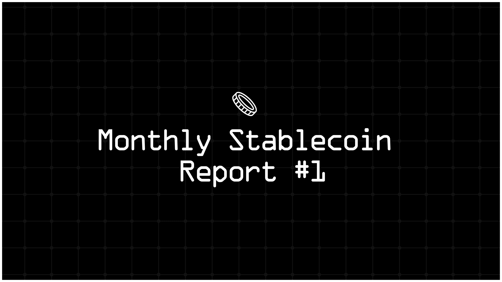

Hey hey, stablecoinjoyers! Welcome to the very first post of the monthly stablecoin report! As you may be familiar from the weekly stablecoin report, we categorize stablecoins into three groups and blockchains into four. The groups of stablecoins are named "leagues" and the chains are named "tiers." Let's begin this month's stablecoin report. In this report, you will find:

* Total review of the stablecoin market and a breakdown by projects.

* Total breakdown of the stablecoin market by blockchains.

* The most attractive stablecoin yields.

* Important events and news from the last month.

* Useful resources for more stablecoin information.

As of May 31st, the total stablecoin market is $160.48 billion, an increase of 0.42% compared to May 1st. USDT's dominance of the entire stablecoin market is 69.56%, up from 69.15% last month.

The total market cap of stablecoins with a market cap over $1 billion, i.e., the stables of the first league, is $154.23 billion, down by 0.16% compared to the beginning of May. The dominance of Tether in the first league was over 70% throughout May. The pie chart below shows the dominance of Tether relative to the stables of the first league at the end of May.

In May, Ethena's USDe was the biggest gainer, with a 28.40% market cap increase, corresponding to $662 million in new USDe. The total market cap of USDe reached $2.99 billion. The biggest loser in the first league was FDUSD, which shrank by about 34%, corresponding to a $1.30 billion market cap loss. The total market cap of FDUSD became $2.52 billion. These two major changes caused USDe to overtake FDUSD. Here is the weekly position status of the first league in May. In the position tables, green cells indicate position gainers, whereas red cells indicate position losers.

The other stablecoins in the first league remained more stable compared to USDe and FDUSD. The table below shows the 31-day change in market cap of the stablecoins in the first league.

Now, let's take a look at the second league, i.e., stablecoins with a market cap between $100 million and $1 billion. Last month, significant changes occurred in the second league, bringing the total market cap to $3.97 billion, an increase of 15.77%. The biggest competitor is USDD, followed by TUSD and BUIDL. The pie chart below illustrates the market cap distribution of the stablecoins in this league.

HUSD showed strong performance last month, particularly in the final week. USDB also enhanced its standing in the past two weeks. Below is the weekly overview for the second half of May.

At the beginning of May, HUSD was not in the second league, but it now holds the 8th position with a market cap of $222.6 million, corresponding to a whopping 1336.21% growth. Gemini's GUSD records the other significant movement with a 78.7% increase. Paypal's PYUSD follows GUSD with a 41.1% growth. It's also worth mentioning that USDB and BUIDL showed good performances with 23.4% and 21% increases, respectively. The table below shows the 31-day change in market cap of the stablecoins in the second league.

The market cap change status of this league, i.e., stablecoins with a market cap of between $30 million and $100 million, was generally negative. Eight out of twelve stablecoins in this league lost market cap. As of May 31st, the total market cap of this league is $589.8 million, a 2.05% decrease compared to the beginning of May. The pie chart below illustrates the market cap distribution of the stablecoins in the third league.

The competition in the second league was intense in May. GHO achieved a higher position almost every week. Additionally, USDM, MIM, BEAN, and USD+ competed for positions 6-8 throughout the month.

As of May 31st, GHO has a market cap of $66.3 million, with a gain of $17.4 million. This corresponds to a 35.6% growth compared to the beginning of May. Additionally, LISUSD and BEAN saw 12.6% and 6% growth, respectively. All other stablecoins in this league, excluding BUSD, closed negatively last month in terms of market cap. The biggest market cap loser was SUSD with a 19.37% decrease, followed by MIM and USD+. The table below shows the 31-day change in market cap of the stablecoins in the third league.

Now, let's examine the competition among chains to attract more stablecoins. During May, Ethereum and Tron held more than 85% of total stablecoin issuance. Stablecoin issuance on Ethereum decreased by 1.69%, whereas Tron experienced a growth of 1.63%. As of May 31st, Ethereum's share corresponds to 49.9% of all stablecoins, while Tron's is 35.6%. The pie chart below shows how Ethereum and Tron compare to other chains in holding stablecoins.

To analyze the competition, we need to exclude Ethereum and Tron, just like in the weekly reports.

This tier has $19.73 billion in stablecoins, with a 2.32% increase compared to the previous month. In this tier, there are seven chains competing, with Binance Smart Chain leading the competition. Here is a pie chart of the B-tier chains.

The blockchains in the B-tier mostly protected their ranks in May. However, in the last week, Base flipped Solana and became the third biggest chain in this league in terms of stablecoin issuance.

Last month, Base attracted more than $485 million in new stablecoin issuance, corresponding to an 18.2% growth. The source of this growth is Circle's USDC.

Additionally, Optimism gained a notable stablecoin market cap with a 6.43% increase in total stablecoin issuance. Polygon and Arbitrum's total stablecoin issuance also increased in May. The biggest stablecoin loser of the month was Solana, with a 6.52% decrease due to the loss of $200 million in USDC market cap. The table below shows the 31-day change in market cap of the stablecoins on blockchains in the B-tier.

The C-tier experienced massive growth of 24.6%. As of May 31st, the total stablecoin issuance in the C-tier is $2.318 billion, up from $1.860 billion at the beginning of the month. Currently, the biggest share of this tier belongs to Near, followed closely by Blast and Sui. The pie chart below illustrates the market cap of the stablecoins on blockchains in the C-tier.

Aptos joined the competition in this chain last week. It's not wrong to say that Near, Blast, and Sui competed for the top position throughout the month. In addition to those, there was also intense competition among Kava, Stellar, and Gnosis.

In the competition table above, it seems Fantom lost some positions; however, this is not due to a loss in market cap of stablecoins in May. In fact, all the chains in the C-tier saw growth last month. The biggest growth belonged to Blast, with a 14.84% increase, giving it a stablecoin market cap of over $420 million. The table below shows the 31-day change in market cap of the stablecoins on blockchains in the C-tier.

Let's investigate the D-tier now. At the beginning of May, there were 14 chains in this tier, and as of May 31st, there are 12. The two missing chains are Aptos and Kava; both have been listed in the C-tier since they exceeded $100 million in stablecoin issuance. The total stablecoin issuance in the D-tier increased by 3.1%, reaching $696 million. Note that since Aptos and Kava are no longer in this tier, these values do not include them. The pie chart below shows the competition among chains in the D-tier.

In terms of ranks, we haven't seen major changes in the D-tier during May. In the column for last week, there are seven green cells; however, six of them gained positions due to Aptos leaving the tier. Apart from this, only Heco moved up the table.

Nine out of twelve chains in this tier lost market cap last month. However, due to Heco's growth of 63.6%, the overall market cap of this tier is positive. Additionally, Starknet saw notable growth, with a 22.1% increase in stablecoins. On the loss side, the biggest decrease belongs to Mode, with a 31.2% drop. The table below shows the 31-day change in market cap of the stablecoins on blockchains in the D-tier.

Let's take a look at the stablecoins offering the highest APYs. These yields are sourced from DeFiLlama and include all types of yields with over $10 million in TVL. Remember that interactions with contracts carry various risks, including hacks, exploits, impermanent loss, depegging scenarios, etc. Please be aware of these risks before engaging and always DYOR!

* **[Ethena Launches Synthetic Dollar on Blast Layer 2](https://thedefiant.io/news/defi/ethena-brings-synthetic-dollar-to-blast-layer-2)** Ethena Labs' synthetic dollar, USDe and sUSDe, has launched on Ethereum Layer 2 network Blast, integrating native yield across six DeFi protocols. This move enhances liquidity and yield farming options, with protocols like ThrusterFi and Juice Finance offering substantial rewards for staked assets. Despite controversy over its double-digit yields, Ethena's innovative approach has driven its total value locked (TVL) to $2.9 billion, making USDe the fourth largest stablecoin by market cap.

* **[Gnosis Pay and Visa Collaborate for Enhanced Web3 Payments](https://thedefiant.io/news/defi/gnosis-pay-partners-with-visa-to-expand-web3-payments)** Gnosis Pay has partnered with Visa to launch a self-custodial Visa Debit Card linked to a Safe smart account, allowing crypto enthusiasts to make purchases at over 130 million locations globally. Early adopters will enjoy zero transaction fees and exclusive rewards. This collaboration highlights Visa's continued engagement with the crypto industry and expands Gnosis Pay's reach in Web3 payments.

* **[Sphere Labs Introduces Bank-to-Wallet Telegram Extension](https://cointelegraph.com/news/blockchain-dev-sphere-bank-wallet-telegram-extension)** Sphere Labs, a blockchain developer focused on stablecoin services for businesses, has announced a new bank-to-wallet extension for Telegram. This feature will allow users to transfer funds directly between their bank accounts and Telegram wallets for a 0.1% transaction fee. The service, available for USD and euro-denominated bank accounts, will open to early users the week of May 27, with a full launch expected later this year.

* **[Stablecoin Market Cap Hits Two-Year High as Dominance Declines: CCData](https://cointelegraph.com/news/stablecoin-market-cap-rises-to-2-year-highs-as-dominance-slides-to-6-ccdata)** According to CCData, the stablecoin market capitalization reached a 24-month high of $161 billion in May, marking eight consecutive months of growth. Despite this increase, stablecoin market dominance slightly decreased to 6.07%. Tether (USDT) reached an all-time high market cap of $111 billion, while Circle's USDC saw its market cap grow for the sixth consecutive month to $32.6 billion.

* **[MakerDAO Introduces New Stablecoins to Replace DAI](https://thedefiant.io/news/defi/our-most-read-stories-this-week-pump-fun-hack-blast-token-s-and-p-on-rwa-solana-vs-ethereum)** Rune Christensen, the founder of MakerDAO, announced the introduction of two new stablecoins, NewStable and PureDAI, as part of the Endgame plan. These stablecoins aim to replace DAI, which is currently valued at $5.4 billion. NewStable will be the successor of DAI, focused on growth, yield, and resilience, while PureDAI will focus on being maximally decentralized.

* **[Liquity Launches Innovative Stablecoin with User-Defined Rates](https://www.coindesk.com/tech/2024/05/14/defi-lender-liquity-unveils-new-stablecoin-with-user-set-borrowing-rates-in-white-paper/)** Liquity is launching BOLD, a new stablecoin backed by liquid staking ETH derivatives, allowing borrowers to set their interest rates. Scheduled for release in Q3, this upgrade aims to enhance liquidity and returns for investors, differentiating from its existing LUSD stablecoin.

* **[crvUSD Outperforms Curve DEX in Revenue Despite Lower Market Cap](https://x.com/DeFi_Made_Here/status/1791429869420650833)** A recent tweet by @DeFi_Made_Here highlighted the profitability of stablecoins in the DeFi sector, noting that crvUSD generates more revenue than Curve DEX. Despite having a market cap of $130 million only, crvUSD's revenue exceeds that of Curve DEX, underscoring the strong business potential of stablecoins within decentralized finance.

* **[Tether Takes Action Against Phishing Scams, Freezes $5.2M in USDT](https://cointelegraph.com/news/tether-freezes-usdt-phishing-scams)** Tether froze $5.2 million in USDT across 12 Ethereum wallets tied to phishing scams, continuing its efforts to combat illicit activities. Since its inception, Tether has blocked over $1 billion in assets linked to various illegal operations, collaborating with global law enforcement.

* **[Circle Moves Legal Base to US, Prepares for IPO](https://cointelegraph.com/news/circle-shifts-legal-home-us-ahead-ipo)** Circle, the company behind USDC, announced plans to move its legal base from Ireland to the United States, aligning with its upcoming IPO. This move, while increasing compliance costs, aims to bolster investor confidence amidst tightening U.S. crypto regulations.

I hope you've found this report informative. From now on we will be publishing monthly stable reports in addition to weekly reports! See you in the next report. In the meantime, you can read other posts on Ethereum2077. And if you missed last week's report, you can read it [here](https://ethereum2077.substack.com/p/weekly-stablecoin-report-5). Finally, keep enjoying stability!
