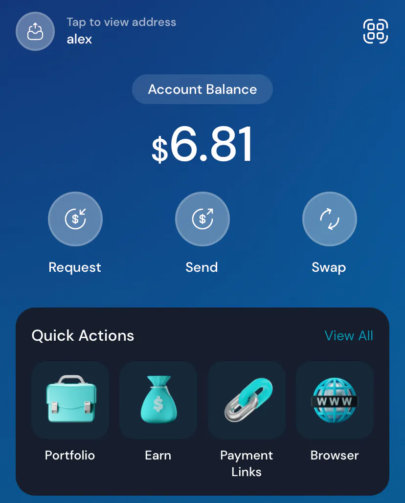
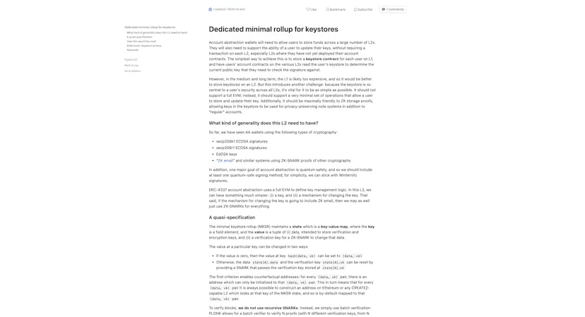
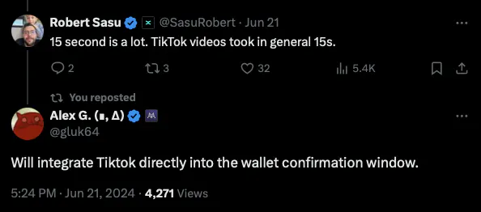
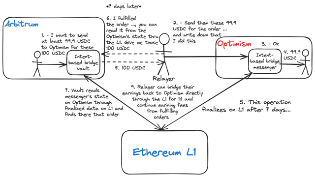
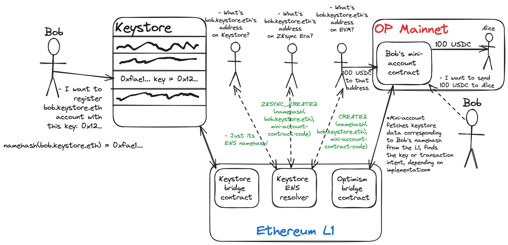

As a rollup-centric ecosystem enthusiast, I've always been interested in solutions that improve rollup interoperability. Moreover, the sole reason I created this blog was to promote [a message of the importance of interoperability](https://mirror.xyz/alexhook.eth/g8FifgWnh6w9fIXX4DJrZXFf3nsr0dPgARrdFtzbHNs) in this area. Then, I realized that writing articles is an excellent way to consolidate my understanding of a certain topic and help people understand it, and now I'm here.

As every day in crypto is learning new things, it should seem obvious that today, I see the vision of _"Rollup interoperability is crucial for Ethereum future"_-era me as pretty outdated. From the POV of philosophy, I still follow the same vision - **rollup interoperability is absolutely crucial for the future of Ethereum**, and the entire ecosystem should work on solutions that improve it. From the POV of technology, however, I learned a lot of new ideas about this topic and changed my mind about some things.

To understand the material below, it’s helpful to have a basic understanding of rollups and the problem of their interoperability. If you don’t, my article [“Dr. Dankshard or How I learned to stop worrying and love rollups“](https://mirror.xyz/alexhook.eth/g8FifgWnh6w9fIXX4DJrZXFf3nsr0dPgARrdFtzbHNs) is a great introduction.

**Merhaba!**

Istanbul, L2DAYS, 14th November 2023. Myself staying at the food court to the side of the conference building. Mosyo Coffee, where zkCafe took place, is on the front.

It's the evening of 13th November, the first day of [Devconnect Istanbul](https://devconnect.org/istanbul). As a massive fan of zkSync, I decided to attend zkSync Connect as my first event at this summit, the first of my life. There, I met a guy, and together, we headed to "Mosyo Coffee," as stated on the Luma page of zkCafe. There were two of them in that area, and we found the right place only by the evening.

It was much darker than in the photo above and was pouring downpour. Staying at the edge of the roof on which the food court was located and drinking a coffee we bought for free tokens on [Clave](https://getclave.io), I told my new friend about my idea for a hackathon project.

That one coffee. Cost me 3 WEN.

There are "mini-accounts" - [ERC-4337](https://ercs.ethereum.org/ERCS/erc-4337) (AA) accounts, whose validating logic is not a signature check but the existence of the operation's hash in the single inbox bridge on its L2. The hash must be sent from its parent address on a specific source chain. The parent address is your main smart wallet on any L2 or Ethereum L1. To interact with another L2, you:

* Deploy the mini-account on it and set your main wallet as the parent address. Anyone can do the deployment; thus, it can be funded by the protocol or your wallet provider.

* Send the hash of the user operation you want to send to the inbox bridge on your L2 and set the destination chain ID.

* This hash gets bundled with other hashes and sent to the L1. The smart contract on L1 forwards this bundle to the destination L2, and the inbox bridge unbundles the hashes so that the mini accounts can read them.

* The sender adds a small fee to its hash to incentivize initiators of the transactions on the protocol's smart contracts.

* When the hash reaches the destination L2, you send your user operation to the AA mempool on this L2. By utilizing the ERC-4337 standard, we don't have to reimplement our own mini-account mempool and the protocol can be easily integrated into wallets with an already existing codebase.

Shortly speaking, I was going to create an L1-based bridge that sends transactions from the smart wallet on your L2 to any L2 you want to interact with. I ended up [almost implementing it at the hackathon](https://github.com/alexhooketh/xtra-protocol) but couldn't finish it due to having little experience and working solo. After explaining it to the friend, he asked me:

> Why doesn't one just change the network on their wallet and use token bridges to move the needed funds to the needed network?

I answered: This is absolutely an option if one uses an EOA wallet. EOA wallets act the same in all EVM networks and share the same address, so you can send transactions in all of them by just changing the network in your wallet settings.

However, the area is migrating to Account Abstraction-based smart accounts. These accounts allow us to add any functionality we want to our wallets programmatically. P256 signatures make it possible to [use secure chips in our phones](https://mirror.xyz/0x8958D0c419BCDFB8A86b8c0089552bE015fbe364/hvpY_houtY9gGDnT8-jthCmE963EawYnyITogyNP_ZU) to sign transactions. Through social recovery, we can add our relatives as guardians authorized to recover our wallets, eliminating unsafe seed phrases. Paymaster technology allows us to pay the gas fee in any token or even [make someone pay the fee for us](https://x.com/getclave/status/1779082777012670532). When quantum computers start breaking classic signature schemes, we can just change the scheme in our AA wallets to a quantum-safe one without creating a new wallet. This list can be continued endlessly, as Account Abstraction essentially allows us to use executable programs as full-fledged wallets.

All this comes at a cost: One can't easily migrate their wallets to another chain because, besides moving the funds through the bridge, it requires redeploying the entire account with all the keys, guardians, and settings. In some cases, this might be too complicated or even impossible—say, in rollups that don't support [the P256 precompile](https://getclave.notion.site/2295a4513abe46f5a49a41097b88def0?v=e430de5755d9436c8e1de2c9cc9932a1&pvs=4), this signature scheme might be too expensive to use.

This is why I made that protocol. Essentially, you have AA accounts on many L2s. To send a transaction from them, you must verify your intent by sending a hash of it from your main account on a specific L2 to those "mini-accounts" through the L1 bridge messaging. In fact, this way, you don't get rid of multiple wallets; you simply move all the verification logic to a single "parent" account.

Another interesting detail of such a protocol is that it allows for interoperability not only with L2s but with all L1s sidechains, as they have enshrined bridges with Ethereum—Polygon PoS, Ronin, Gnosis, and Avalanche are what I can think of. However, it was designed as a rollup-centric interoperability protocol, so this is just a fun technological fact.

While the idea of the project was pretty clever, the practical implementation had a significant drawback: **speed**.

The entire design relies on canonical rollup bridges connected to Ethereum L1. Rollup bridges are peculiar in that they prove their state to their smart contracts on Ethereum to inherit its security. As you may already know, optimistic and ZK verification are the two most popular ways to do this.

Optimistic verification works by opening a "challenge window," usually about seven days, in which the challengers can send a fraud proof that points to any invalid part of the transaction batch. If this proof is valid, the rollup reorgs its blockchain to delete this batch. After seven days with no fraud proofs, the batch is automatically considered valid, and all messages and withdrawals are finalized on Ethereum.

You probably already figured it out. Due to a 7-day delay in messaging to L1, sending cross-chain transactions from an optimistic rollup is a **terrible** idea. Why? Well, will you wait for your DEX swap for a week? What's going to happen with the price by this time?..

Sending cross-chain transactions _to_ the optimistic rollup is much better. Even though the OP Stack sequencer waits a few blocks before processing the message to minimize the possibility of reorgs, waiting a few minutes for your transaction is already somewhat acceptable for some tasks. Moreover, the Ethereum community is currently working on [single-slot finality](https://ethereum.org/en/roadmap/single-slot-finality/), which will make every block finalize separately, making them irreversible by their next block. After it's implemented, messaging from L1 to L2 will take about 12 seconds.

Hosting such accounts on ZK rollups would be better, but still not very usable. As we can see from the stats below, ZKsync Era finalizes in 21 hours, Linea in 5 hours, Starknet in 9 hours, etc.

Screenshot from docs.optimism.io

But why is it like this? Isn't ZK proof generation fast on powerful clusters? In short, there are two problems:

* Some ZK rollups, such as ZKsync Era, set execution delays so that the security council has time to revert some batches in case of a bug in their proof system. zkEVMs are really complicated pieces of technology, and due to this complexity, probabilistically preventing bugs by using multiple proof systems at once is not yet feasible.

* Even though ZK proof verification is very light compared to the computations it proves, verifying it on-chain is still pretty expensive. Depending on the proof system, it can take up to a million gas per verification. Taking the average gas price of 9 gwei and today's ETH prices, a single proof costs about $30 only for verification on L1. Modern ZK rollups minimize these expenses by generating one proof for many batches once per a certain amount of time, but this slows bridge finality speed. Generating a batch and proving it every block makes $30 per block or **$216,000 per day**. At 100 TPS, this is about $0.025 per transaction just for verification costs. And we've also got to generate the proof and publish the batch on-chain!

Waiting an hour or two for a transaction is still too long. What can we do about it?

First of all, let's forget my eight-month-old hackathon project and try to eliminate the mental model that every transaction needs to be initiated from our main smart wallet. Why do we even need to share our smart wallet logic in every rollup? Why don't we just generate temporary EOAs, bridge the funds from our main smart wallet there, do some work we want to do, and bridge what's left back?

Screenshot from l2beat.com/scaling/finality

My [Clave](https://getclave.io) (or whatever smart wallet you're using) has Secure Enclave signing and social recovery, so I can always be safe about my funds there, even if I lose my phone. And who cares what happens with those temporary accounts? I've already done my stuff with them; all funds are on my Clave now.

However, this approach has a fundamental problem: the assumption that you can't use the same wallet on other chains on a regular basis heavily restricts the number of tasks you can do on them. For example, you can't create a deposit in a local lending platform because you can't migrate it to your main network _(ZKsync Era in this case)_. You can't get tokens that don't have a fungible equivalent in your main network (e.g., if they're natively minted on that network). You can't participate in a local DAO because your votes have to stay in that temporary account. Essentially, all you can do as a user is disperse funds to multiple recipients without bridging each time and get better liquidity for a swap to a token that can be bridged back to your main chain.

Thus, to make these wallets useful, we have to access them using the same rules we use on our main smart wallets—secure enclaves, social recovery, etc. So, we get back to the idea above and its infeasibility. There is, however, a _feasible palliative_ that can give these mini-accounts only _recovery_ properties of our main wallet:

I came up with this thought while looking at Clave's UI

We create the same mini-accounts described earlier but allow one key to send transactions from them directly. Our parent wallet can now change this key through the L1-based bridge or make the mini-account read it from the parent L2's state. This way, if the temporary key is lost, the parent wallet can initiate a key change through the slow but atomic L1-based bridge.

> _Atomicity — the property of an action that doesn't allow it to fail during execution. Either it wasn't initiated, or it was done._
_L1-based bridges are atomic because the message can't be lost if it's sent. Ordering, availability, and authenticity are guaranteed by the Ethereum L1._

This is much better! Now, ordinary transactions only take time for token bridging. After the tokens are at the destination, sending transactions is as fast as if it's your main chain. If you lose the key, you'll have to wait from several hours to 7 days, depending on the chain of your parent wallet, but you won't use it very often, so the trade-off is acceptable for most use cases. Also, it's feasible to implement in wallets even today. [I even made my own implementation](https://github.com/alexhooketh/unclave), but it's not by any means secure or production-ready and is meant only for visualization purposes.

A similar technique is used in Web3 futures trading platforms: you approve the token in pair (usually USDC) to the smart contract and assign a temporary key for spending, which is stored on the platform's frontend. This allows users to perform fast actions without signing each action with their main wallet. If you change your device or clear the data in your browser, you can just re-assign the key using your main wallet.

But, just as with everything in crypto, this approach is not perfect either. It has two disadvantages:

* Even though mini-accounts can be ERC-4337-compliant and thus support all its features, such as batching, paymasters, spending limits, etc, these features are no longer inherited from the parent account. In fact, the parent account just acts as a single social recovery guardian for the mini-account, but the guardian is the user themselves.

* Token bridging must be accomplished using external bridges. With cross-chain transaction initiation, we can carry our tokens with the message, receiving them practically 1:1 in an atomic way. However, with this solution, this is no longer an option, so external bridging is the only fast option left.

At this point, it's worth taking a note about security properties. Using external bridges to transfer tokens is somewhat acceptable, unlike using them to pass messages to operate mini-accounts. The reason is their worst cases, likely due to an attack on them:

* _In token bridging,_ the worst that can happen is that you won't receive the tokens you sent. In such case, you lose X tokens you wanted to bridge and switch to another bridge.

* _In cross-account messaging,_ the worst that can happen is that all your mini-accounts can be stolen by passing impersonating messages through the bridge. In such case, you lose your wallets on all chains with all their value, except your main one.

So, relying on external bridges for token bridging is pretty much an option as long as one has no efficient way to bridge them in an atomic way using L1.

Suppose we want to _validate_ all transactions in a single place, for example, to natively transfer tokens between accounts or verify signatures with a unique precompile. In that case, we face the slow finality of today's ZK rollups.

Let's return for a little while to think of what can be improved with the previous technique. Why do rollups have slow bridge finality? We'll take ZK rollups as a target because, with optimistic ones, the reason is already apparent:

* ZK proof systems for full-fledged VM environments are complicated, especially if the environment is not ZK-friendly (EVM). Therefore, there is a high chance that they will contain bugs. Multiple proof systems can prevent this, but such are very complicated to implement, and generating multiple proofs for a single batch may be too slow and expensive. As a workaround, rollup teams enable execution delays, which allow them to roll back the chain in an emergency. This is what slows the bridge finality in some rollups (e.g., ZKsync Era).

* Proposing the new state and ZK proving it to L1 are pretty expensive tasks, so to minimize costs, the rollup sequencers do it every few hours rather than every block. There is an exception, however; [Scroll proposes the state about every minute](https://l2beat.com/scaling/liveness), but a) proof verifying is still done every few hours, so it stays unverified, and b) Scroll is one of [the most expensive rollups](https://l2beat.com/scaling/costs?sort-by=total-cost&sort-order=desc) to use today.

If we rephrase it even more simply, the problems are proving costs and verifying costs. Let's look at each problem and ways to solve it.

Essentially, our task is to make our smart wallet on a rollup quickly interoperate with other rollups without additional trust assumptions brought by external bridges. Smart wallets typically consist of a few usual AA features—paymasters, social recovery, secure enclaves, spending limits, etc.—and the main operation that allows us to send on-chain transactions from it.

Why do we need the main operation if we want to use the other rollups from our wallet? Because it is probably hosted on a multipurpose rollup—Arbitrum, Base, ZKsync Era—and we want to interact with users and smart contracts on this rollup, too.

In this particular case, it would make sense to simply use external token bridges. Just replace the task with, for example, interaction with a dApp in the same rollup and another one

This multipurposeness is what introduces complexity to the proof system of the rollups. Verifying the state of the entire virtual machine with lots of smart contracts and transactions happening every second is a pretty tall order. We want to execute two types of tasks that require a completely different set of features in the rollup: for an on-chain transaction, it is fast L2 inclusion, low L2 fees, and wide functionality of VM, and for a multi-rollup transaction, it's fast bridge finality.

_But what if we just get rid of the virtual machine_ and build a rollup that can only handle smart accounts and messaging to the other L2s? Vitalik Buterin proposed a similar technique at just about the time of Devconnect Istanbul:

**Keystore rollups**

The idea is to create a ZK rollup that can only store the account keys and change them using another key. This rollup pushes the root of the Merkle tree that contains all these keys to L1. Then, when you want to send a transaction from one of your smart accounts on L2s, you generate the Merkle proof of your current key, and your account verifies it against the keystore root available on the L1. Now, it knows your key and can use it to verify your signatures.

Add a Merkle or KZG proof check to it, and this is what it looks like

Such rollup is very simple, and multiple proof systems can easily be implemented, so keys stored in it are actually as secure as the L1.

Besides Vitalik's original design, there are three leading ones for keystore rollups:

* [Scroll's](https://scroll.io/blog/towards-the-wallet-endgame-with-keystore) approach is to store keystore data on L1 but allow updating it from their zkEVM rollup. For this, they're introducing an L1SLOAD precompile that allows for cheap reads of L1 storage. Then, AA accounts on other L2s can read this data to synchronize their configuration—keys, guardians, etc.

* [Base team](https://hackmd.io/@mdehoog/mksr) is exploring a technique where only the state root is stored on L1, but transactions are sequenced using calldata, so the tree can always be rebuilt. Accounts on L2s are expected to fetch current keys using Merkle proofs.

* [Stackr's](https://mirror.xyz/stackrlabs.eth/4kLzcBdvWnvECxOnaGQ8prAqUZEzj4BoDoXqSSXiV6w) design is very similar to Base's or Vitalik's, but it utilizes its own framework of "micro-rollups" with specialized minimal VMs.

Generally speaking, they differ in the number of tasks delegated to off-chain processing (in other words, how many things are on L2) and their implementation details.

We can expand this idea further by handling _not only the keys_ but also the **entire smart account logic**. This wouldn't be much more computationally difficult, either; essentially, we only need to handle these tasks:

* **Sending data to L1:** Accounts on the keystore rollup must be able to notify L1 about their transaction intent. Storing the entire transaction on L1 is not necessary; something like a root of a Merkle tree with all hashes of the user operations would be enough. Then, all that's needed to send a transaction from a mini-account is reading the root from the destination L2 and making proof that a certain AA operation was actually requested from the parent account.

* **Signature checks:** The user signs the hash of the user operation they want to execute on a certain rollup. The keystore rollup verifies the signature to prove intent and adds the hash to the tree to then push it to the L1. A few signature schemes, such as [ECDSA](https://www.evm.codes/precompiled#0x01?fork=cancun), [P256](https://github.com/ethereum/RIPs/blob/master/RIPS/rip-7212.md), and [quantum-safe ones](https://en.wikipedia.org/wiki/Lamport_signature), are enough.

* **Social recovery:** Make the other, purposefully chosen accounts, called "guardians," vote for the key change on the user's account. The user can set the guardians and threshold and ask them for recovery in case of key loss. We can also implement [veto-based recovery](https://blog.getclave.io/recovery-for-everyone-cloud-and-guardians) or alternative guardian schemes such as [ZK-Email](https://blog.getclave.io/universal-recovery-a-social-recovery), ZK-OTP, or [Web Proofs](https://pluto.xyz) to expand social recovery outside the rollup's users.

* **Spending rules:** In case the wallet is stolen, spending rules controlled by guardians can greatly decrease potential losses before the user recovers the wallet. This feature is also helpful for saving funds or, for example, making wallets for children—parents can send an allowance and restrict how much of it can be spent so that the child can learn to save.

* **Token balances:** This might seem unnecessary, but being able to store crypto _inside_ the keystore rollup dramatically increases the security of users' assets by not separating them into multiple mini-accounts. Also, it allows for many features that enhance user experience:
* **Paymasters:** The rollup may offer free transactions to attract new users or allow them to pay the fee with any token rather than only ETH. More complicated paymaster logic can be implemented, too—for example, the sequencer can take a fee from the swap on another chain when it's bridged back to the keystore rollup.

* **Internal token transfers:** Besides instantly sending funds between rollup users, direct transfers are also helpful for implementing intent-based bridges with other rollups that have too slow finality to use L1 to bridge from the mini-account to the parent account on the keystore rollup. This way, the keystore rollup can essentially act as a hub to transfer tokens between mini-accounts on dozens of various L2s cheaply.

Such a system is much technically simpler than a full VM inside of a rollup, so it's feasible to generate proofs for multiple proof systems simultaneously, and the complexity of proof generation will still be much less.

However, proof verification is still a problem. As we've calculated before, its gas cost can be up to 1M gas or ~$25-50, depending on the gas price. This cost is fixed and doesn't depend on the number of transactions in the batch. This means that if there are too few transactions, the fee for each transaction can be very high. There are two main ways to reduce this cost:

**Aligned Layer**

[Aligned](https://alignedlayer.com) is an EigenLayer AVS that utilizes restaking operators to verify ZK proofs cheaply. If you're not familiar with EigenLayer, this is a simplified summary of how proofs are verified in Aligned:

* A user sends the proof verification request to the network and pays the fee for it;

* Aligned operators, each of which is an Ethereum validator with their deposits bonded, verify the proof on their nodes and sign for its validity;

* When 2/3 operators sign for the proof, the aggregated signature is sent and verified on Ethereum L1.

* If an invalid proof has reached finality, validators who signed for it can be slashed by verifying it on-chain. This way, the proof gets economic security equal to 2/3 of the total stake of Aligned operators.

This approach has an obvious drawback—Ethereum no longer guarantees proof validity. If the TVL of the rollup's bridge is higher than 2/3 of the total Aligned stake, attacking it becomes profitable. And since we're talking about the finality latency of 1-2 blocks, we can't optimistically prevent the attack.

However, this might be a relatively safe option as long as the rollup doesn't get too large. When it does, the transaction demand could already make L1 proof verification worthwhile. According to docs, verifying the ZK proof using Aligned costs about 3000 gas, which is nearly free even for Ethereum L1.

**Proof aggregation layers**

If you're uncomfortable introducing additional trust assumptions to the system, or your protocol has already become too large, but its transaction demand has not, there's an alternative.

ZK and rollup teams have recently started actively working on proof aggregation protocols. If you're not very familiar with ZK, proof aggregation is when a ZK proof proves the validity of another ZK proof (that can, in turn, prove another proof, and so on), thus "aggregating" them in the single proof and essentially moving all their verifying costs to proving costs. What's left is verifying a single ZK proof on-chain and being sure about the validity of all the other ZK proofs it proves. Phew!

Istanbul, L2DAYS, 14th November 2023. Myself staying at the food court to the side of the conference building. Mosyo Coffee, where zkCafe took place, is on the front.

Proof aggregation makes sense where verifying costs are higher than proving aggregating proofs. That is, aggregation becomes profitable if the cost of generating a proof for ten proofs and verifying it is less than verifying these ten proofs independently. This is even more helpful in Ethereum L1, which is heavily restricted by computational capacity. Depending on the proof system, the entire block can only contain [about 100 proof verifications](https://docs.alignedlayer.com/about-aligned/how_does_aligned_work#introduction), excluding all the other on-chain activities.

Generally, there are two types of proof aggregation protocols:

* **General purpose (Universal) aggregation:** Such projects usually support several of the most popular ZK protocols (Groth16, Halo2, Plonky), on top of which most ZK circuits are built and take a fee for processing. The dApps that need the proofs then reveal the data from the protocol and process it on their own. [Nebra's Universal Proof Aggregation system](https://www.nebra.one), currently in development, does exactly this. Aligned is also working on so-called ["slow mode" verification](https://docs.alignedlayer.com/about-aligned/how_does_aligned_work#aggregation-mode), which is, in fact, a proof aggregation system, too.

* **Aggregating shared rollup bridges:** Similarly to shared sequencing in optimistic rollups, ZK rollups with their stacks are working on shared bridges with aggregated state proofs for every ZK rollup in the bridge. This not only allows synchronous composability inside the stack ala shared sequencing but also minimizes the costs for proof verification. You might have heard of Polygon's [AggLayer](https://polygon.technology/blog/aggregated-blockchains-a-new-thesis) or ZKsync's [Hyperbridge](https://docs.zksync.io/zk-stack/concepts/zk-chains), which are shared rollup bridges that work on proof aggregation inside the bridge.

The advantages of universal aggregation systems are that they're project-agnostic and only specialize in the aggregation process itself, which opens pretty fast verification of proofs and low costs. Also, it's likely not to have training wheels because of the lack of the bridge component.

Aggregated rollup bridges, in turn, are helpful for the keystore rollup to have synchronous composability with an already existing rollup stack. For example, [according to L2BEAT](https://l2beat.com/scaling/summary), 13 projects are currently built using Polygon CDK, and 11 use ZK Stack. When they all connect to a shared proof aggregating bridge, connecting the keystore rollup to one of them will open seamless interaction with many L2s without even touching the L1. For this to work, the bridge must support different state transition logic for its L2s because the keystore rollup's logic differs from the other L2s in it.

However, these bridges are usually upgradable and controlled by its DAO or security council. Keystore rollup projects may not be comfortable with giving up their sovereignty to the operators of the bridge they're connected to. Also, bridges may introduce execution delays as a training-wheels precaution, similar to how ZKsync Era operates now, which essentially kills the entire efficiency of this keystore rollup design.

Istanbul, L2DAYS, 14th November 2023. Myself staying at the food court to the side of the conference building. Mosyo Coffee, where zkCafe took place, is on the front.

This way, keystore rollups, like any other ZK rollups, can minimize proof verification costs and even combine this with synchronous composability with an already existing rollup stack.

**Efficient intent-based bridging with "Keystore+" rollups**

As previously discussed, bridging from L2 to L1 is not the only problem. Most rollup sequencers also apply delays to passing messages from L1 to L2. This is because when an Ethereum block is created, it's not yet final and can be reversed within the following ~64 blocks (two epochs, about 13 minutes). These reorgs happen because of network latencies, causing some proposals to appear in the network too late when some nodes already consider them missed.

Istanbul, L2DAYS, 14th November 2023. Myself staying at the food court to the side of the conference building. Mosyo Coffee, where zkCafe took place, is on the front.

If a team implementing this extended keystore rollup design isn't comfortable with such transaction latency, it can implement a palliative described earlier. Every mini-account has a key authorized to send transactions or utilizes a static key from the keystore (as per Vitalik's original design), but account management is still on the main keystore account. After SSF is implemented on L1, the rollup can remove the authorized spending keys, and users will get the entire AA customization functionality without significant speed degradation.

However, cross-rollup token transfers still present a problem. If we implement token vaults inside the keystore rollup, transferring tokens from it will take 1 to 15 minutes, depending on the recipient rollup. If we do not, splitting users' balances into mini-accounts on multiple L2s can pose security risks and even lock some assets into illiquid L2s, bridging from which may cost too much or take too long.

As an alternative, we can integrate an intent-based bridge into the rollup and deploy it on all the other rollups or even reuse existing infrastructure, such as [ERC-7683](https://ethereum-magicians.org/t/erc-7683-cross-chain-intents-standard/19619)-compliant protocols.

_— What's an intent-based bridge?_

Most existing cross-chain bridges are based on messaging protocols. For example, [Stargate](https://stargate.finance/bridge) uses [LayerZero](https://layerzero.network) to pass messages about deposits to destination chains, relying on it as the source of trust. When you send tokens through such bridges, they lock your tokens on one side and send a message about your deposit on the other side, and the vault there unlocks the respective amount of tokens for you.

Istanbul, L2DAYS, 14th November 2023. Myself staying at the food court to the side of the conference building. Mosyo Coffee, where zkCafe took place, is on the front.

Intent-based bridges, in turn, do not send messages between two chains. Instead, funds being sent are locked in the vault as a "cross-chain order," and then anyone can fill the order by sending the requested amount of tokens on the destination chain. Whoever fills the order can then claim the locked tokens from the source chain when the vault in it gets informed about the finalized state of the destination chain and can confirm the transfer. This can happen either by waiting for the destination chain's objective (bridge) finality or via some external oracle protocol. For example, [Across uses UMA's optimistic oracle](https://docs.across.to/reference/security-model-and-verification) to fetch the state of not yet finalized L2s.

Istanbul, L2DAYS, 14th November 2023. Myself staying at the food court to the side of the conference building. Mosyo Coffee, where zkCafe took place, is on the front.

We can use the same design for these extended keystore rollups to implement trustless, fast, and cheap two-way bridging between the keystore and all other L2s. Fast bridge finality allows intent-based orders _from_ the other L2s to be nearly free because proving the fulfillment on the L2 takes just a few minutes. Orders from the keystore will probably be cheap as well, as liquidity on the L2 can be supplied relatively fast through the keystore. This way, such keystore rollup design can become a hub for intent-based bridging, allowing users to send transactions instantly rather than in a few minutes, paying nearly nothing for bridging. The rollup team can also supply liquidity for bridging through the keystore 1:1, and this would not cost them a lot.

**Unified ENS name for all chains**

Imagine having a single _username.eth_ that resolves to all your mini-accounts, no matter which chain the recipient is on. This design makes this possible. How?

As we already know the address of our main keystore account, we can use [multichain factories](https://github.com/pcaversaccio/createx) and [CREATE2](https://www.evm.codes/#f5?fork=cancun) to make the addresses of our mini-accounts the same across all bytecode equivalent EVM chains, even including Ethereum L1. Then, we set the unified address in the ENS resolver, and our name works in all EVM L2s.

However, there are two exceptional cases:

* **Bytecode inequivalent EVMs, such as ZK Stack.** For them, we can generate a custom address according to their CREATE2 rules and add it to the ENS with their chain identifiers according to [ENSIP-11](https://docs.ens.domains/ensip/11).

* **Non-EVM L2s, such as our keystore.** The logic is the same for them, but instead, we add their custom addresses to the ENS according to [ENSIP-9](https://docs.ens.domains/ensip/9).

While being very UX-friendly, this approach uses a lot of expensive computation and storage on L1 because names and addresses are stored on L1 resolvers. This problem can be solved using [CCIP Read](https://docs.ens.domains/ensip/16), but I came up with another, more efficient on-chain resolution logic:

Istanbul, L2DAYS, 14th November 2023. Myself staying at the food court to the side of the conference building. Mosyo Coffee, where zkCafe took place, is on the front.

Every account on the keystore is registered and indexed by the namehash of its ENS name, registered under a single ENS name with a custom resolver. When its subdomain is resolved, the resolver contract checks if the account with such namehash exists in the rollup and uses the namehash to generate CREATE2-based mini-account addresses. When these are deployed, they will ask L1 for the keystore data _belonging to the namehash_ they were deployed with. It can be the transaction intent itself or just the current signing key, depending on keystore implementation.

This way, we get keystore accounts, each with an ENS name resolving to itself and its mini-accounts on each rollup. These mini-accounts, in turn, will also rely on this ENS name when validating the transaction using the keystore rollup.

Istanbul, L2DAYS, 14th November 2023. Myself staying at the food court to the side of the conference building. Mosyo Coffee, where zkCafe took place, is on the front.

**Sequencing mechanisms on "Keystore+" rollups**

As bridge finality on the extended keystore rollup is supposed to be a few L1 blocks, we may as well get rid of the centralized sequencers entirely, turning it into a based rollup. As we've discussed before, ~12 seconds of transaction speed is acceptable for the average user, but based sequencing would make the rollup much more resistant to censorship and single points of failure.

It's worth considering that with based sequencing, internal transactions will take as long as external ones (excluding time to reach L2). This may be unacceptable for some teams, as centralized sequencing makes all internal operations instant.

**Alternative advances in rollup interoperability or Why I did not mention shared sequencing**

I wrote the entire article around ZK rollups and ZK technology. This is because optimistic rollups cannot fundamentally have fast objective finality, and such a property is only reachable using ZK. Today's optimistic rollups understand their sealed position and are actively researching the feasibility of integrating validity-centric designs in their stacks, hence, for example, [the recent partnership of Optimism and RISC Zero](https://x.com/RiscZero/status/1793633136636530816).

Istanbul, L2DAYS, 14th November 2023. Myself staying at the food court to the side of the conference building. Mosyo Coffee, where zkCafe took place, is on the front.

Optimistic design is fundamentally restrictive in that it will never handle interoperability with other rollups. However, interoperability _within_ the optimistic ecosystem is developing rapidly. The primary technology for making optimistic rollups interoperable with each other is **shared sequencing**. Simply put, this is a mechanism where a sequencer can build a batch for multiple rollups simultaneously. If any transaction in any of the rollups sequenced is invalid, the entire batch can be disputed and reverted.

This gives all batches in this "mega-batch" the atomic property—either all batches are valid or none. This, in turn, allows for atomic synchronous composability inside the batch. Atomic—because nothing in the batch can be invalid if it is valid, synchronous—because all messaging is inside the batch, which is processed simultaneously by all its rollups' nodes.

This technology basically turns all rollups in a certain optimistic stack into one big, sharded rollup. Why only one stack and not all of them? Because in order for this to work, rollups must be connected to a single bridge. Each stack has its own bridge, and there's no reliable way to build batches in multiple bridges simultaneously. This means that shared sequencing allows OP Mainnet to seamlessly interoperate with Base and Zora but not Arbitrum or Metis, and vice versa.

Such consolidation creates a dangerous situation in the rollup ecosystem. New rollups have the option to either join the existing stack and be integrated with it but not with anyone else OR build on top of ZK and be integrated with anyone but the stack above. There is no such choice now because shared sequencing is not yet available, and each OP Stack or Arbitrum Orbit rollup is independent, with its own bridge. However, when they consolidate, they will form two solid organisms within the ecosystem, each holding [about 40% of total L2s TVL](https://l2beat.com/scaling/summary).

_— Okay. If they will hold the vast majority of total TVL, why don't we get rid of ZK and build on top of them instead?_

First of all, shared sequencers are a huge centralization driver. If you run an OP Mainnet sequencer, your batches won't include transactions from other rollups in the stack; you'll earn less in fees and eventually be outshined by large commercial sequencers that can handle the entire stack in their batches.

However, the most critical problem is that in such a case, the rollup ecosystem becomes enclosed within **oligopolistic empires** pursuing their own interests, seeking to establish more control over the capital, and slacking on technological progress in the ecosystem. We would then have to deal with Ethereum being crushed into a disjunct area where PR and intraspecific struggle are what matter, not technologies that actually change the world.

> **"Build tools, not empires**. Empires try to capture and trap the user inside a walled garden; tools do their task but otherwise interoperate with a wider open ecosystem."—[Vitalik Buterin](https://vitalik.eth.limo/general/2023/12/28/cypherpunk.html)

_— How are aggregating shared bridges in ZK better than optimistic shared sequencing?_

In ZK rollups' shared bridges, sequencing can be done independently from the other rollups in the bridge. Each rollup can have its own sequencer or implement shared sequencing. _Proposers_ who assert the resulting state root after all sequenced batches and prove it using ZK are the ones doing aggregation.

Moreover, the characteristic of relatively fast objective finality in ZK rollups does not make them enclosed inside their ecosystem, no matter how large it grows or how centralized it is. When ZK is developed to the level when big zkVM proofs for multiple proof systems can be generated rapidly, all ZK-based rollup stacks will interoperate nearly seamlessly, just like theoretical keystore rollup described above sends transactions in all the other rollups in a matter of L1 blocks.

_— But how come optimistic rollups still exist if they're so evil, and there's an alternative in ZK rollups?_

Within our community of researchers and highly technical people, the consensus is that ZK is the best scaling solution. And you'll be surprised to realize that for regular users and builders, optimistic rollups are much better than ZK! How come?

For users, there's a well-established ecosystem. All platforms know what Arbitrum and Base are, dApps always have high liquidity, and the UX is fragrant. Try to name an application on Base, and you'll instantly remember Friend.tech, Farcaster, Daimo, Time.fun, various NFT collections, ZKP2P. Even Mirror initially supported only OP Stack rollups for minting. Try to name an application on ZKsync Era. _Uhhh..._

For developers, there's absolute Ethereum equivalence, so the entire Ethereum and EVM forks infrastructure works from the box. Besides that, the documentation scrupulously defines and explains all peculiarities and tooling of optimistic rollups. There are a lot of tutorials, courses, marathons, developer relations, and so on.

On the other hand, there are year-old zkEVMs, not all of which even have bytecode equivalence. They all have a long list of differences and difficulties when building on top of them. They're mostly poorly documented, and there's significant reliance on existing infrastructure that is barely compatible with the networks. Auditing "compatible" VMs is very difficult and expensive, and you don't even have a ChatGPT to ask. _Its answer probably works for Base, but does it for Linea?_

For users, ZK rollups have no ecosystem. There are no applications to use, no social, no popular NFTs or tokens, and all activity boils down to airdrop farming. You'll barely find liquidity for pairs not in the top 10 of the Ethereum ecosystem, and [DefiLlama](https://defillama.com/chains) starts showing ZK rollups when you get tired of scrolling.

_— But optimistic rollups actually win by compatibility with existing infrastructure. How can ZK rollups beat them in it?_

You don't have to introduce bytecode equivalence, or blake2f precompile to attract developers and activity to your platform. ZK rollups are not supposed to be better in that. Instead, in their fast finality & interoperability, fully horizontal scalability, fundamentally higher security, and decentralization. This is what should be utilized in projects in the ecosystem of ZK rollups to make them advantageous in the ecosystem.

I wrote this article to put together a complete picture of all these technologies, including ZK rollups, that have appeared and developed in the area during this time and show how they can be used to solve today's most important problem in the field—rollup interoperability. We have to embrace ZK and its limitless benefits. We have to use them to our advantage to build things that get us closer to making Web3 a place for everyone in the world.

Istanbul, L2DAYS, 14th November 2023. Myself staying at the food court to the side of the conference building. Mosyo Coffee, where zkCafe took place, is on the front.

This is perhaps the largest comparison table I've ever made. No wonder—in the last year, the Ethereum community has come up with many new ideas and technologies that can be flexibly combined and manipulated to create completely new solutions that solve the most pressing problems in the area, even with existing tech.

Yes, I am still convinced that rollup interoperability is the most pressing problem that prevents us from onboarding the entire world to Web3. Scaling is no longer so urgent—4844 allows us to handle up to a thousand transactions per second, comparable to financial activity in the largest countries in the world; PeerDAS, coming in a year, will increase this even further. Fragmentation, however, still poses a severe threat to the Ethereum ecosystem. No matter how large it grows, the ecosystem should not feel like a dozen distinct empires but as one large mechanism. So different, but so identical.

We are not early, and this article is supposed to show you that. We must use all our strengths to develop working systems that help the gigantic L2 ecosystem interoperate. This is possible right now. Soon, you should be able to participate in any DAO and send any assets to the ENS, the owner of which is several thousand kilometers from you. Geographical borders should not be replaced by digital ones.

If you liked this work, agree with its thesis, learned something new, or want to spread this message further—mint it below, share it on social media, leave your comments, and talk about the importance of rollup interoperability more.

Thank you for reading.
