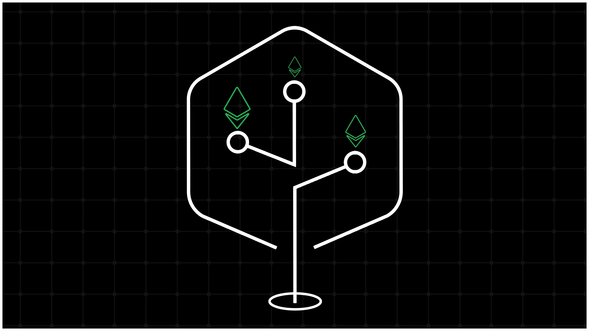

So, you must have heard folks in the Ethereum community talk about "The Verge" upgrade—which comes after The Merge and The Surge in Vitalik's roadmap—and you know it has to do with something called "Verkle trees". But you're still in doubt and want answers to the following questions:

**1. What are Verkle trees?**

**2. Why does Ethereum need Verkle trees?**

**3. What "tree" type is Ethereum using currently and why is a switch necessary?**

**4. How will Ethereum transition to using Verkle trees?**

**5. What are the implications of upgrading to Verkle trees for the Ethereum ecosystem?**

Well, you're in luck. After spending a lot of time reading posts from Dankrad Feist/Vitalik Buterin on Verkle trees and watching Guillaume Ballet's talks on the topic (which I highly recommend watching, if only for the memes and jokes), I _may_know a thing or two about Verkle trees enough to write a series about it.

Note that I'll be oversimplifying many things in this article and subsequent posts; my intention is to give a crash course on Verkle trees, not a lecture, so you know _just_enough to understand how how Verkle trees—and the Verge—fit it into Ethereum's technical roadmap. There's a substantial amount of talk about cryptography, but trust me, I'm not a cryptographer, and reading this article won't require a CompSci degree.

Which also goes to say: if you _are_a cryptographer, and you spot errors while reading, please excuse them:

Ethereum is often described as a "state machine" (in addition to "world computer", "global settlement layer" or more colorful variants like "The Infinite Machine") unlike Bitcoin's description as a "distributed ledger"; this distinction has to do with how Ethereum stores information. While Bitcoin stores only [UTXOs (Unspent Transaction Outputs)](https://academy.binance.com/en/glossary/unspent-transaction-output-utxo)—which are mapped to private keys controlled by a user—Ethereum has a concept of "accounts" and stores specific information about Ethereum accounts in a key-value store:

* **Contract accounts (smart contracts)**: storageRoot, nonce, balance, and codeHash
* **Externally Owned Accounts (EOAs)**: Balance, nonce (storageRoot and codeHash are empty in the case of EOAs)

These data collectively form Ethereum's "state" and when we talk about state, we're typically referring to things like balances of accounts (contracts and EOAs), contract code, contract storage values, and so on. To understand this aspect of Ethereum in more detail, I encourage reading _ [How Does Ethereum Work, Anyway?](https://www.preethikasireddy.com/post/how-does-ethereum-work-anyway)_by Preethi Kasireddy.

What makes Ethereum a "(transaction-based) state machine" is that the blockchain's state changes as transactions are processed in the [Ethereum Virtual Machine (EVM)](https://ethereum.org/en/developers/docs/evm/).The EVM stores the information associated with accounts in a "tree" to enable efficient retrieval of data (among other benefits). A [tree](https://en.wikipedia.org/wiki/Tree_(data_structure))is a hierarchical data structure made up of a set of interconnected nodes; a node is a "child" or "parent" node depending on its position in the tree; parent nodes can have many child nodes (depending on the tree type), but every child node has exactly one parent.

Ethereum uses a modular architecture for storing state data, so one tree stores information about transactions (**transaction trie**); another tree stores information about account storage (**storage trie**); and a third tree stores information about transaction receipts (**receipt trie**). As you might expect, it would be clunky to have information about accounts stored in wildly different places—which is why there's _another_tree (**state trie**) that saves all relevant information about Ethereum accounts (EOAs and contract accounts).

The state trie serves a single source of truth for Ethereum's global state and is updated at each block (along with the transaction trie and receipts trie):

A transaction will usually lead to the modification of one or more of these trees—for example, depositing ETH into a Uniswap pool requires creating a new slot in the pool contract's storage and inserting a new value (i.e., the total deposit associated with that user) in the storage trie. This will in turn lead to the EVM updating the value of the storage root associated with the pool's contract account, which will further cause the root of the state trie to change as well.

Each of the "trees" mentioned above is a [Modified Merkle Patricia Trie](https://medium.com/@eiki1212/ethereum-state-trie-architecture-explained-a30237009d4e)(MPT), which is a variant of the Merkle tree (named after Ralph Merkle who invented it in 1979). In the next section we'll dive into Merkle trees properly and understand why they are useful in the context of public blockchains like Ethereum.

A Merkle tree is a specific example of a tree structure that has certain properties, such as guaranteeing immutability and validity of data. At a basic level, a Merkle tree is made up of **leaf nodes**(a.k.a., _leaves_) that store a cryptographic hash of a piece of data and **parent nodes**(a.k.a., _branches_) that store hashes of the leaf nodes.

To build a Merkle tree, you hash a block of data to form the leaves, hash two (or more) of those leaves to form a parent node, and continue this process until you end up with a single parent node and no remaining leaf (child) nodes. The is last parent node is called the "root" of the tree; you can see from the image below that the final data structure looks like an inverted tree:

So, what's the point of building up a Merkle tree? For starters, Merkle trees enable efficient verification of the contents of a data structure by storing cryptographic commitments (generated using collision-resistant hash functions) to the data. That's a lot of jargon for an ELI5 article, so I'll break down the important terms:

1. **Cryptographic commitments**: A commitment scheme allows one party (the prover) to commit to a particular message _m_and later reveal _m_to another party (the verifier). Cryptographic commitments are so-called because they are _binding_—suppose Alice generates a commitment _C_to a message _m_and sends _C_to Bob; if Alice later reveals _m_, Bob should be confident that the message _m_committed to by _C_is equivalent to the message Alice revealed.

Commitment schemes may also have a _hiding_property: if Alice sends _C_during the committing phase, Bob shouldn't be able to extract the original message _m_from _C_. However, the hiding property of a commitment scheme isn't strictly as important as the binding property, except in cases where preserving privacy of exchanged information is critical.

2. **Hash functions**: A hash function is an algorithm that takes as input an arbitrarily-sized piece of data and maps it to a fixed-size string, where the output string represents a cryptographic commitment to the original data (i.e., h(x)→ y). Hash functions are _one-way_: you can find the hash of a data block by running the data through a hash function, but reversing the process—extracting the original data from the hash—is computationally infeasible. Hash functions are also _collision-resistant_: it is computationally infeasible to generate the same hash for different blocks of data (i.e., you cannot find two inputs _a_and _b_that produce the same hash as output, where a ≠ b).

The properties of hash functions make them useful in creating Merkle tree structures; in fact, Merkle trees are also called "hash trees" for this reason. Merkle trees built using hash functions have many applications, such as verifying data transmitted between computers and validating data blocks received from peers in a distributed storage system, like the InterPlanetary File System (IPFS).

Merkle trees also function as a _cryptographic accumulator_. Put simply, a cryptographic accumulator allows you to store a set of values and later prove to another party that one or more values are part of the original data stored in the accumulator. Ethereum's state tree is an example of a cryptographic accumulator; anyone can prove knowledge of certain data in the tree (e.g., account balances and storage values) by providing evidence to a third-party verifier.

In the context of a Merkle tree, the process of "providing evidence" is the same as demonstrating that a particular leaf node is part of the tree—with the root seen as a commitment and leaf nodes revealed to be part of the original commitment. We'll go into details of how this process works, but let's understand why this is even possible in the first place:

As mentioned, a Merkle tree is built up by hashing data blocks to create leaves and hashing leaves to create parent nodes and hashing parent nodes to create a parent node at one level higher—until we end up at the root node. However, unlike regular hash function that simply maps an arbitrarily-sized piece of data to a fixed-size string ([play with an example of a hash generator](https://passwordsgenerator.net/sha256-hash-generator/)to see how this concept works), the hash function used to build up a tree is a bit different and functions as a _vector commitment scheme_(albeit a weak vector commitment; this detail will become clearer over the course of this article).

Vector commitment schemes allow you to (cryptographically) commit to a _vector_or list of values (_x 1_, _x 2_, _x 3_,... _x n_) and prove to another party that a value _x_exists in the vector by opening the commitment _C_(_x 1_, _x 2_, _x 3_,... _x n_) at a particular position (a.k.a., an _index i_). In a Merkle tree, this vector commitment is generated via a hash function that takes as input a hashing list h(x1 , x2 , x3 ,...xn ) and outputs _C_which is a hash of the input data. Like other commitment schemes, vector commitments are _binding_(a prover cannot open the same commitment to two different values at the same position or index) and optionally hiding (a verifier shouldn't learn the entire vector even after a prover opens the commitment to reveal certain values).

One way of proving that x _n_is a member of the vector commitment _C_(_x 1_, _x 2_, _x 3_,... _x n_) is to send the original length of data committed to by _C_to the verifier. Then, you could reveal x _n_at index _i_and have the verifier to compare the value you provided for x _n_to the value associated with x _n_in the original data.

But that defeats the point of using a cryptographic commitment scheme—which we do primarily to enable a third party to verify the authenticity of particular piece of data without having to send over all of that data (if they already have the data, they can easily verify if you're telling the truth or not). Importantly, in certain contexts, like blockchain networks, we want to reduce how much data is shared between peers and keep bandwidth requirements low.

So, what do we do?

We send the minimum amount of data (described as a _witness_) that the verifier needs to check that "the value of xn at index _i_in the vector x1,...xn " is true. If you think of witnesses as people who stand in courtrooms and say "yes, I saw Mr. X do something at so-and-so time", you're on track to grasp the concept of witnesses as it relates to vector commitments; specifically, a witness proves the inclusion of xn in the vector and helps verify that the prover opened the vector commitment to a valid value (where "valid" means "part of the original data").

How witnesses are created varies, but we'll stick to the example of Merkle trees at the beginning for the sake of simplicity. Below is a binary Merkle tree (binary means each parent node can have at most two child nodes) where Alice wants to prove to Bob that a piece of data whose commitment is the leaf x1 is part of the tree's data:

If you go back to the original introduction to Merkle trees, you'll recall I said that parent nodes at each level in the tree are created by hashing child nodes together, and child nodes at the base of the tree are created by hashing blocks of data. This means the _entire_tree is connected by hashes at each level, making it easy to detect if two trees are the same. You only have to compare the root node for both trees; if the root nodes differ, the two trees also differ.

Thus, to check Alice's claim that the leaf xn has a particular value x in the tree, Bob only needs the following (note that Bob doesn't need to store the underlying data represented by the Merkle tree in this scheme):

* The root node of the current Merkle tree (which already references the data Alice is trying to prove due to parent-child relationship described previously)
* All the data required to compute parent nodes on the path leading from leaf xn to the root node (including the data for leaf xn itself)

The data Bob needs to compute parent nodes on the path from leaf xn to the root of the Merkle tree is the set of hashes belonging to the siblings (or "sister nodes") of leaf x1 . Here's the same tree from the previous example—but now we highlight (in red) the nodes whose hashes are required to prove leaf x1 's inclusion in the original Merkle tree:

You may already see the relationships already; if not, here's a rough explanation:

* Bob hashes the data for leaf x1 and hashes leaf x1 and leaf x2 together to get the hash of the parent node y1
* To get the hash of root node y3 , Bob hashes together sibling nodes y1 and y2
* Bob compares the hash of the newly computed root node y3 with the existing hash of root node in his possession.

A difference in the value (hash) of the root node hash calculated using witness data provided by Alice and the value (hash) of the root node in Bob's possession can only mean one thing: the leaf data Alice is trying to prove is incorrect and absent from the original (canonical) Merkle tree. Additionally, the parent-child links represented by hashes at each level of the tree leading up to the root, and the deterministic nature of cryptographic commitment schemes, rule out the case where Alice has the correct leaf data, but somehow generates a witness that fails to convince Bob that the value revealed for the leaf in question (x1 ) is correct.

Now that we've seen how witnesses work, it's time to understand a key problem with Merkle trees: large witness sizes. Proving that a particular value exists at some leaf in the tree requires providing hashes for all sibling nodes; when the tree's depth—that is, the number of levels from a leaf node to the root—is small, witness sizes are manageable as in the previous example:

However, witness sizes increase (significantly) as the depth of the Merkle tree increases. In the example below of a binary Merkle tree with depth = 4, a witness for the leaf x1 requires providing _three_sibling hashes (the hash of leaf x2 and nodes y2 and y6 ) and the root hash:

You can already see how this trend plays out: the more leaves (data) are added to the tree, the more data we need to create a witness that proves a particular leaf is part of the tree. If you're feeling like a giga-brain at this point, you may ask: _"Can't we just reduce the depth (height) of the tree by increasing the number of children per parent node?"_

Since witness sizes seem to be growing in proportion to the height _k_of the tree, reducing _k_could (theoretically) lead to smaller witnesses—especially if it reduces the number of sibling hashes we need to provide for the witness. This approach sounds nice in theory, but doesn't work out so easily in practice (it _does_work in certain conditions, which we'll go into later).

Here's an example of a _3_-ary Merkle tree where each parent node can have up to three children:

At first glance, we've managed to solve the problem of storing more leaves without increasing the tree's height (this tree has 9 leaf nodes in total and depth = 3 compared to the preceding example of a binary tree with 8 leaf nodes and depth = 4). But how large will the witness for a leaf (e.g., x1 ) in the new tree be? _Very_large as you see in the diagram (the hashes required to compute the path from x1 to the root (y4 ) are highlighted in red):

We now need hashes for _four_siblings (leaf nodes x2 and x3 and inner nodes y2 and y3 ) to create a witness for leaf x1 's inclusion in the Merkle tree. Increasing the branching factor (the formal name denoting how many children each parent in the tree can have) to eight—which gives us an _8_-ary (octary) Merkle tree—worsens the problem:

We've increased the size of the tree further without increasing the depth, but proving the value at x1 now requires a total of _nine_hashes (the hashes of leaf nodes x2 , x3 , x4 , x5 , x6 , x7 , x8 , and x9 and the hash of the branch node y2 ). This short "tutorial" shows why Merkle trees are considered a weak form of vector commitment: the witness size is proportional to the size (width and depth) of the data structure (tree). But we want witnesses that remain constant regardless of the tree's size—and the more useful vector commitment schemes will guarantee this property for the most part.

The vector commitment scheme we're interested in is one where membership proofs for values in the vector are independent of the size of the vector; in a Merkle tree, that means the witness for a leaf shouldn't equal the size of the tree. The vector commitment scheme proposed by Dario Catalano and Dario Fiore in their paper _ [Vector Commitments and their Applications](https://eprint.iacr.org/2011/495.pdf)_satisfies this property and is useful for creating "ideal" Merkle trees with small witnesses.

In a Merkle tree based on this type of vector commitment:

* Each branch (parent) node stores a commitment _C_to a vector (sequence of values) representing all child nodes connected to it. The commitment _C_is generated using a cryptographic protocol that (crucially) doesn't rely on hash functions to guarantee _position binding_(i.e., the property that a prover _P_cannot open the same commitment to two different values at the same position).

* Each leaf node (at every level of the tree) includes a succinct proof _π_of its membership in the vector committed to by its parent node. The membership proof _π_is derived with respect to the (vector) commitment _C_—allowing a prover _P_to convince a verifier _V_that the value of a leaf is equal to the opening of the vector commitment _C_at that specific position in the tree.

We're interested in the aforementioned vector commitment scheme because it enables proving the inclusion of a leaf in a Merkle tree-like structure _without_having to provide data for the sibling nodes. In the original example of a Merkle tree, parent nodes stores a commitment to children in the form of a hash (generated by hashing the child nodes together); proving that a particular child node was included in the commitment stored by the parent required providing hashes of _all_other connected child nodes.

In this case, however, parent nodes store a fixed-size commitment string to child nodes—and proving the connection between a child node and a parent node only requires verifying that the membership proof _π_was validly derived from the commitment _C_. Since _C_is generated over the set of nodes connected to the parent, a valid witness proves the value of the child node truly represents the opening of the commitment at that particular position.

Since every leaf node stores a membership proof, a verifier only has to verify a proof at each intermediate level of the tree on the path from the leaf to the root—instead of having to rebuild the root by hashing child nodes together when moving up the tree. This is useful in our case because it changes the interaction between a prover and a verifier: it is possible to create a commitment C(x1,...xn) for the range of values committed to by a parent node, derive a membership proof _π_for a leaf (which we'll call x1), and pass this set of data as a witness to leaf x1's membership of the Merkle tree.

Here's what a new (binary) Merkle tree—using a vector commitment—looks like:

As you can see, each leaf stores a membership proof _π_and each parent (branch) node stores a commitment _C_to its children. Now, if Alice needs to verify to Bob that a particular value exists at leaf x1 in the Merkle tree, she only needs to provide the following data as a witness to Bob:

* The value for x1 (this is a regular hash of the data stored in the leaf)
* The membership proof _π1_proving x1 's inclusion in the vector (x1 , x2 ) committed to by x1 's parent node
* The vector commitment _C1_that references all child nodes connected to branch node y1
* The membership proof _π5_proving y1 's inclusion in the vector commitment _C3_stored by the root node y3 (note: we assume Bob already has C3)

In previous examples, Bob needed to rebuild the root by accessing intermediate hashes before verifying if Alice opened the commitment correctly. However, with VCs, Bob won't need to explicitly know about any other nodes beyond inner (branch) nodes on the path leading from the leaf to the root because the membership proofs provide enough information to verify parent-child relationships at intermediate levels of the tree. (The root commitment _C3_commits to a vector that includes y1 and y2 , and membership proofs for branch nodes y1 and y2 (_π5_and _π6_) are derived from _C3_).

The vector commitment described above—though even _that_can be improved—gives us the property we want in a Merkle tree structure: small witnesses. The tree structure based on vector commitments is formally known as a _Verkle tree_("Verkle" is a portmanteau of **Ve**ctor commitment and M **erkle**tree) and was [invented by John Kuszmaul](https://math.mit.edu/research/highschool/primes/materials/2018/Kuszmaul.pdf).

Witnesses for leaves in a Verkle tree will typically have the following (ideal) properties:

**1.** **Succinctness**: The witness for a leaf (i.e., vector value) should be easy to verify much quickly compared to verifying the entire vector. Succinctness also ensures the witness size only grows _sublinearly_even as the underlying data grows _exponentially_. We can illustrate this property by comparing the previous example of a standard octary Merkle tree—where a parent node can have up to eight children nodes—to a Verkle tree where parent nodes commit to child nodes using vector commitments instead of hashes:

Previously, Alice needed exactly _d_-1 hashes (where _d_is the width of the tree and number of leaves per branch) _and_other intermediate sibling hashes on the path to the root—which added up to a total of eight hashes in the octary Merkle tree example—to to prove the inclusion of leaf x1 in the Merkle tree. In contrast, the witness for x1 in the Verkle tree requires only _three_commitments: the vector commitment _C1_, membership proof _π1_(to verify the relationship between x1 and y1 ) and membership proof _π17_(to verify the relationship between y1 and the root).

Alice also doesn't need to provide information about unaccessed sibling nodes on the path from the root node y3 to the leaf x1 —the witness Bob needs to verify if Alice's opening of the root commitment _C3_is correct is made up of exactly _one_proof (and the vector commitment _C1_as extra data) at each level of the tree. As with previous examples, we assume the verifier (Bob) already has a commitment to the root node.

An implication of this property is that increasing the number of children per branch (parent) node in our new tree has a negligible impact on the overall witness size. If we want to store more data (i.e., add more nodes to the tree), while keeping witness sizes small, we can increase the width to make the tree shorter and reduce the levels from leaf nodes to the root. Here's an example of a _hexary_Verkle tree (width = 16) where each branch (parent) can have up to 16 child nodes:

The new Verkle tree has 38 individual nodes in total, compared to 18 nodes for the preceding example—but the size of the witness for leaf x1 is _still_the same and requires just three commitments (π1 , π33 , and C3 ). While this is a contrived example to show the efficiency gains from using vector commitments, it hints at the importance of vector commitments in production networks like Ethereum, which (currently) uses a hexary Merkle tree to store state as shown in the graphic below:

**2.** **Constant size**: The witness for a leaf should not correlate with the length of the vector (i.e., the size of the data we're committing to). Verkle trees satisfy this requirement as a membership proof _π_derived with respect to a vector commitment C(x1 , x2 ,...xn ) always uses the same number of elements from the group due to nature of the vector commitment scheme. This is in contrast to the vector commitment used in a traditional Merkle tree: a membership proof is always _d_-1 hashes of the leaf's immediate sibling nodes and any other sibling nodes at intermediate levels of the tree.

_Note: Saying "cryptographic mechanism" may seem hand-wavy, but that's the best way of explaining it for folks who don't know moon math. If you're feeling brave enough, you can [read on elliptic curve pairings](https://medium.com/@VitalikButerin/exploring-elliptic-curve-pairings-c73c1864e627)(the formal name for our "cryptographic mechanism") for more low-level details._

But that's not all: vector commitments also ensure that an increase in the tree's width—the number of levels from the lowest leaf to the root of the Merkle tree—has minimal impact on the witness size. Let's put that into context:

In the previous example of an octary Merkle tree the number of hashes Alice had to provide for the witness progressively reduced until she reached the root node—Alice gives Bob seven hashes at the first level and one hash at the second level of the Merkle tree. Compare that to the example of an octary Verkle tree where Alice always provides one proof (with the commitment string as additional data) at each level of the tree on the path to the leaf value she wants to prove:

So far we've established that vector commitments have some nice properties compared to cryptographic hashes in Merkle trees—for example, you don't have to provide (unaccessed) sibling nodes as part of the witness for a leaf—but how does that help us in practical terms? You'll recall the original reason I adduced for wanting better vector commitment schemes than hash functions used in a standard Merkle tree:

_"This short tutorial shows why Merkle trees are considered a weak form of vector commitment: the witness size is proportional to the size (width and depth) of the data structure (tree). **But we want the size of witnesses (membership proofs) that remain constant regardless of the tree's size—and the more useful vector commitment schemes will guarantee this property up for the most part**"_

In the next article in the series on Verkle trees, I'll (formally) lay out the reason we want to use a Merkle tree that produces small witnesses to store Ethereum's state. Since reducing witness sizes is the dominant rationale for switching to Verkle trees—and one of the key reasons for the Verge—the next post will focus on more practical applications of the various concepts (vector commitments, witnesses, et al.) discussed in this article.

For now, you can try to guess why Verkle trees are important to Ethereum's roadmap by looking at some of the goals of The Verge in Vitalik's roadmap infographic:

If you've found this article informative, consider sharing it with someone else who's interested in learning about the next phase of Ethereum's (ambitious) roadmap. You can connect with me on [Twitter/X](https://twitter.com/eawosikaa)and [LinkedIn](https://www.linkedin.com/in/emmanuelawosika/)—if only to say "came for the content; stayed for the memes." Oh, and don't forget to subscribe to Ethereum 2077 for more deep dives on all things related to Ethereum R&D.
