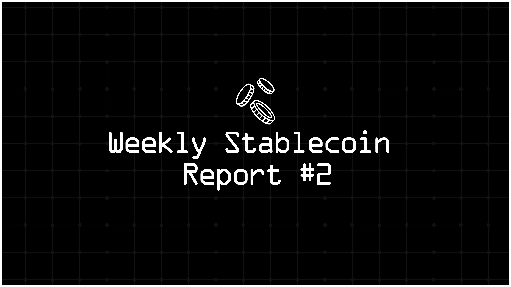

Hey hey stablecoinjoyers, we have awesome news! Starting now, your favorite weekly stablecoin report will be a part of Ethereum 2077. Are you ready for the very second post of our weekly stablecoin reports? In this report you will find:

* Total review of the stablecoin market and a breakdown by projects.

* Total breakdown of the stablecoin market by blockchains.

* The most attractive stablecoin yields.

* Important events and news from the last week.

* Amazing resources for more stablecoin information.

* Last words.

As of May 7th, the total stablecoin market is $160.2 billion, up by 0.34% from last week. USDT dominance is 69.14%, which was the same last week. To see the dominance of Tether, let's check the pie chart of stablecoins with a market cap over $1 billion, i.e., the stables of the first league.

Current pie chart of stables with over $1 billion market cap:

Tether is still 3.5 times bigger than its biggest rival Circle, which now has a current circulation amount of USDC around $32.8 billion, increased by 1.88% from last week. However, according to data from Visa, USDC has flipped USDT in terms of the number of monthly transactions. This could be due to two reasons: first, USDT holders may be using USDT as a savings instrument instead of a medium of exchange. Second, since it's highly regulated, people trust Circle more than Tether for making payments.

Now let's take a look at the second league, i.e., stablecoins between $100m and $1b. In this segment, we still have 11 stablecoins. Their total circulation amount is currently $3.38 billion, with an increase of 3.6% from last week.

Comparing the last week, we have two major changes. Firstly, BUIDL flipped BUSD to become the fourth largest stablecoin of this league. The total circulation of BUSD increased 0.46% last week, whereas BUIDL's growth was 9.3%. The second flip is between DOLA and LUSD. Last week, DOLA grew 6.14%, making its total market cap $118 million, while LUSD's market cap shrank 0.47%.

Even though BUIDL has the biggest increase in circulation, PYUSD from PayPal has the highest growth rate at 15.7%. In addition to LUSD, USDP decreased by 0.1% and all the others closed the week in the green. For changes in other stablecoins' market caps, you can check the table below.

Now let's examine the competition among chains to attract more stablecoins. Similar to last week, Ethereum and Tron hold more than 85% of the total stablecoin market.

To better understand the competition between chains, let's exclude the major two and create another pie chart. The chart below shows the B-tier chains in terms of stablecoin market cap, i.e., chains that have more than $100 million. We can observe that BSC holds the largest share with 23.8%, followed by Arbitrum with 18%. The reason their rates are lower than last week is our new competitor, Kava. Last week, Kava had about $20m in stablecoin market cap, but after Tether's issuance, which was more than $100m, it's now in the B-tier.

For more details, let's check the market cap values and their changes over 7 days. As we can see, there are 7 chains with more than $1 billion in stablecoin market cap: BSC, Arbitrum, Solana, Base, Avalanche, Polygon, and Optimism, consistent with last week. Additionally, there is no flippening among them, maintaining their positions from the previous week. Arbitrum's gain is huge; it's more than $400m, which means even the change in the stablecoin market cap of Arbitrum is larger than that of 8 chains on this list. Moreover, one shouldn't disregard the potential of Base, which increased by about $300m in stablecoin market cap last week.

In the next tier, Near, Sui, Fantom, Blast, Omni, Kava, Gnosis, and Stellar are the chains with market caps between $100 million and $1 billion. Notably, Fantom, which last week held the eighth position with a market cap of $354.3 million, has moved to tenth place. This shift is due to growth in Sui and Near. Especially, Near's growth, which was $340m last week, is worth mentioning.

Comparing the last week, only BSC and Solana experienced some loss in market cap. We see there is an overall capital gain led by Arbitrum, Base, Near, and Sui. The net capital of those chains reaches $21,562.72b, with around a 7% increase compared to last week.

Let's take a look at the stablecoins offering the highest APYs. These yields are sourced from DeFiLlama and Stable.fish and include all types of yields with over $10 million in TVL. Remember that interactions with contracts carry various risks, including hacks, exploits, impermanent loss, depegging scenarios, etc. Please be aware of these risks before engaging and always DYOR!

* Visa's recent analysis [reveals](https://www.bnnbloomberg.ca/more-than-90-of-stablecoin-transactions-aren-t-from-real-users-study-finds-1.2069080)that over 90% of stablecoin transactions may not be authentic, casting doubts on their widespread adoption for payments. The study, conducted in collaboration with Allium Labs, showed that only about 10% of stablecoin transactions in April were genuine "organic payments activity," totaling $149 billion of the $2.2 trillion processed. This metric was developed to filter out the noise created by bots and high-volume traders, focusing instead on transactions by real users. The implications suggest that stablecoins might still be in the nascent stages as a mainstream payment method, despite their potential to disrupt traditional financial transactions with rapid and cost-effective transfers.

* Proposed regulations in the U.S. might [limit](https://www.coindesk.com/business/2024/04/24/tethers-stablecoin-dominance-may-wane-following-proposed-us-rules-sp/)non-banking institutions to issuing a maximum of $10 billion in stablecoins, potentially diminishing Tether's market dominance and encouraging traditional banks to enter the stablecoin arena. The Lummis-Gillibrand Payment Stablecoin Act could foster a more competitive and diversified stablecoin market, as reported by S&P Global Ratings.

* BlackRock's USD Institutional Digital Liquidity Fund, BUIDL, has quickly [ascended](https://cointelegraph.com/news/blackrocks-buidl-becomes-worlds-largest-tokenized-treasury-fund)as the foremost tokenized treasury fund on a blockchain, surpassing Franklin Templeton's BENJI. Achieving a market cap of $375 million within just six weeks of launch, BUIDL underscores the escalating interest and potential within blockchain-based financial structures.

* Visa's on-chain analytics reveal that Circle's USDC has recently [eclipsed](https://cointelegraph.com/news/circle-usdc-overtakes-tether-usdt)Tether's USDT in monthly transaction count. As of April 2024, USDC registered 166.6 million transactions, marginally outpacing USDT's 163.6 million. This milestone reflects USDC's growing prominence, despite USDT maintaining a dominant market cap presence.

* Efforts to attach U.S. stablecoin regulation to the must-pass Federal Aviation Administration reauthorization were [blocked](https://www.coindesk.com/policy/2024/04/30/stablecoin-bill-unlikely-to-get-pinned-to-faa-reauthorization-putting-effort-on-hold-again/), maintaining the bill's purity. Although there was significant bipartisan maneuvering to leverage the FAA bill to pass stablecoin regulations, congressional leaders opted to keep the bill clean, pushing the stablecoin legislative efforts back to the negotiation table.

* Terraform Labs is [contesting](https://www.theblock.co/post/292249/terraform-labs-lawyers-push-back-against-sec-argue-token-sales-were-mostly-outside-us)the SEC's demand for $5.3 billion in fines, arguing that their token sales occurred primarily outside the U.S. and did not significantly impact American investors. This legal pushback comes as part of an ongoing debate over the reach of U.S. regulatory authority in the global cryptocurrency market.

* Tether has [announced](https://www.theblock.co/post/291938/tether-sees-record-net-profit-of-over-4-5-billion-in-first-quarter-of-2024)a record net profit of $4.5 billion in the first quarter of 2024, driven largely by its U.S. Treasury holdings and strategic investments in bitcoin and gold. This financial milestone underscores Tether's robust position in the stablecoin market and its continued growth in the broader financial ecosystem.

* The European Union is [poised](https://www.coindesk.com/policy/2024/04/29/heres-how-eu-nations-are-preparing-to-enforce-mica/)to implement the Markets in Crypto Assets (MiCA) regulation, focusing specifically on stablecoins. Set to take effect in June, MiCA mandates national regulators to license and oversee stablecoin issuers. This regulation represents a significant step toward standardized oversight across all EU member states, ensuring that stablecoin operations meet stringent compliance standards, enhancing the security and stability of digital currencies within the EU.

* Recent data [indicates](https://www.theblock.co/post/291367/tether-usdc-and-dai-transaction-volume-surpasses-visas-2023-monthly-average-nansen)that the combined transaction volume of Tether, USDC, and DAI has exceeded Visa's average monthly transaction volume for 2023. This milestone reflects the growing prominence of stablecoins as viable competitors to traditional financial systems in terms of transaction throughput and efficiency.

* The trajectory for passing a stablecoin bill in the U.S. Congress is narrowing as election season [approaches](https://www.coindesk.com/policy/2024/04/24/the-ever-dwindling-chances-for-a-stablecoin-law/), making it increasingly unlikely. Despite the collaborative efforts of key legislators, the stablecoin regulation may need to hitch a ride on essential year-end bills if it hopes to pass, highlighting the complex political dynamics at play.

* Aave Labs has proposed substantial [upgrades](https://cointelegraph.com/news/aave-unveils-v4-protocol-overhaul-2030-roadmap)to its DeFi lending protocol, introducing a next-generation framework aimed at refining functionalities such as its native stablecoin GHO and cross-chain liquidity provisions. This strategic evolution is designed to enhance user experience and system resilience.

* Despite the foundational ethos of decentralization in blockchain, notable industry players like Consensys, Ripple, and Stellar are [engaging](https://cointelegraph.com/news/crypto-leaders-should-stop-flirting-with-cbdcs)with central bank digital currencies (CBDCs). This involvement has sparked discussions within the community about the potential implications for privacy and autonomy in the evolving digital currency landscape.

* Despite broader market instability, stablecoin volumes have [remained](https://www.theblock.co/post/291954/stablecoin-volumes-stay-strong-as-fdusd-hits-record-high-while-usdt-declines)strong, with First Digital USD seeing record transaction volumes. While Tether's USDT saw a slight decline, newer stablecoins like Ethena's USDe are gaining significant traction, reflecting a diversifying and competitive market landscape.

* Senators Elizabeth Warren and Roger Marshall are [seeking](https://www.theblock.co/post/291728/sens-warren-and-marshall-pose-questions-to-biden-officials-about-the-use-of-crypto-to-evade-sanctions)clarity from Biden administration officials on the use of cryptocurrencies like Tether to bypass sanctions. Their inquiry highlights concerns over the potential for digital assets to undermine national security and regulatory measures.

* Bitwise's CIO Matt Hougan [suggests](https://www.theblock.co/post/291691/stablecoin-legislation-bigger-than-us-spot-bitcoin-etfs-bitwise-cio-matt-hougan)that forthcoming comprehensive stablecoin legislation could have a more transformative impact on cryptocurrency adoption than the U.S. spot bitcoin ETFs. This legislation is seen as a potential catalyst for mainstreaming stablecoins, enhancing their role in the global financial system.

I hope you've found this report informative. As stated at the beginning, from now on, Ethereum2077 will host the weekly stablecoin reports. Don't forget to subscribe for free to ensure you don't miss future reports and articles. In the meantime, you can read other posts on Ethereum2077, and if you've missed last week's report, you can read it [here](https://arbnom.substack.com/p/weekly-stable-report-1). And remember, always keep enjoying stability.
