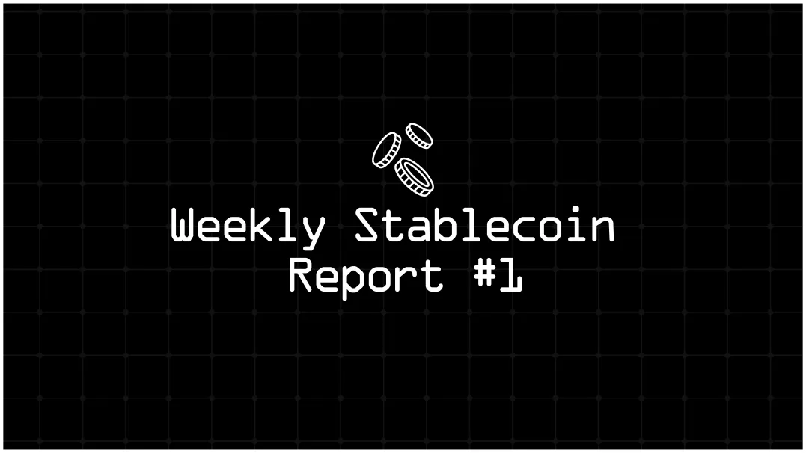
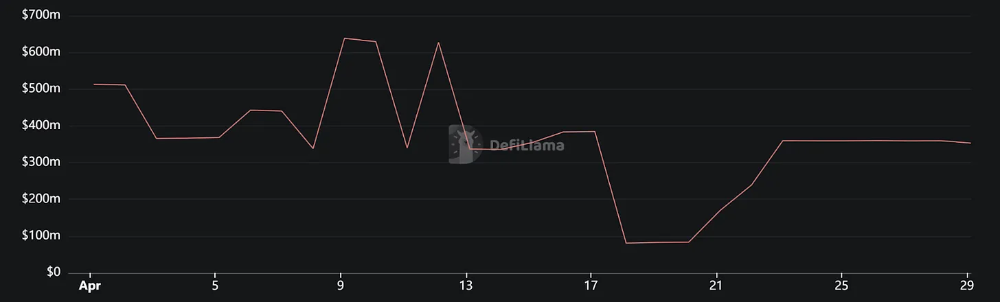
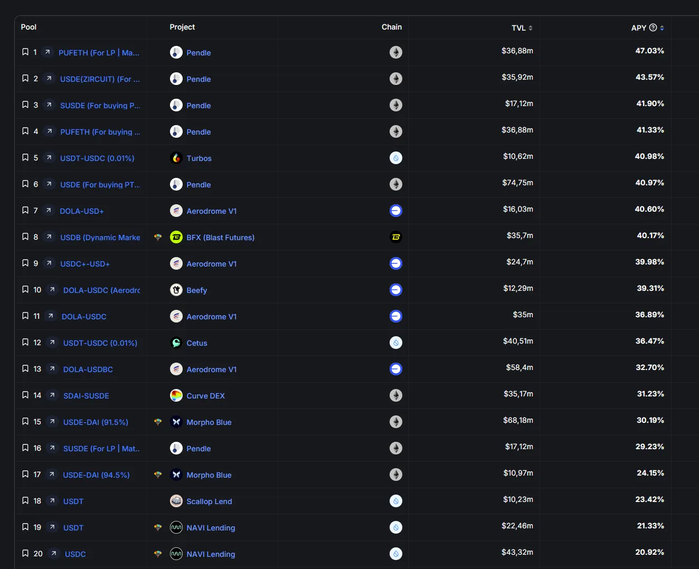

Dear stablenjoyers, welcome to the very first post of our weekly stablecoin reports! Weekly stable reports will not only be prepared to keep you up to date about stablecoin news but also to inform you about all the competitions on stablecoins. Stablecoin projects compete with each other to grow, and chains and dapps also compete with each other to get more stablecoin activity because stablecoin activity is one of the most effective signals that a chain or dapp is used by real users.

Because this is the first one, it will be slightly different from the future reports. In this week's post, you will find:

* Total review of the stablecoin market and a breakdown by projects.

* Total breakdown of the stablecoin market by chains.

* The most attractive stablecoin yields.

* Important events and news from the last month.

* Amazing resources for more stablecoin information
  
* Last words

In the future reports, the events and news item will be updated weekly; hence, we will have space for a short report about a stablecoin project and a short report about a chain in terms of stablecoins. If you don't want to miss them, you can subscribe my Substack right now.

## Total Review of Stablecoin Market and Breakdown by Projects

As of April 29th, the total stablecoin market is $159.9 billion, up by 0.66% from last week. USDT dominance is 68.95%, which was 69.17% last week. To see the dominance of Tether, let's check the pie chart of stablecoins with a market cap over $1 billion, i.e., the stables of the first league.

Current pie chart of stables with over $1 billion market cap:

As we see, Tether is 3.5x bigger than its biggest rival Circle. Tether being the monopoly of the stablecoin market is scary, but it's not more scary than a scenario where USDT loses its peg. Let's hope that this scenario never becomes true and check a more fair rivalry: stables between $100m and $1b, i.e., the second league.

Even if USDD and TUSD are the two biggest actors of this competition, they can't dominate the entire race like Tether. Especially, TUSD is closely followed by FRAX, BUSD, BUIDL, and USDB. By the way, if you haven't read the Bluechip's report about USDD, you should definitely read it right now. They expose serious risks about collateral type and, more seriously, issues concerning collateral ownership. They say, "The wallet containing USDD's BTC has been claimed by Huobi exchange as their own. As both USDD and Huobi are controlled by Justin Sun, we suspect the commingling of assets."

For more details about the second league of stablecoins, let's see the most notable gainer and loser. Last week's most significant market cap growth belongs to FRAX with a 16.94% increase, which translates to a $55.7m increase in market cap. Gemini dollar has the largest loss with an 11.70% decrease, equating to a $13.39m market cap decrease. For the changes in other stablecoins' market caps, you can check the table below.

Note that last week, Gemini's GUSD had a market cap of over $100 million, but it currently stands at $95.7 million, representing a 15.5% decrease in total market cap.

Now let's examine the competition among chains to attract more stablecoins. Similar to the dominance of Tether and Circle in the stablecoin market cap, Ethereum and Tron rule more than 86% of the total stablecoin market.

To better understand the competition between chains, let's exclude the major two and create another pie chart. Here we can observe that BSC has the largest share at 27.4%, and the competition is more balanced compared to the Ethereum and Tron domination mentioned above.

For more details, let's check the market cap values and their changes over 7 days. As we can see, there are 7 chains with more than $1 billion in stablecoin market cap: BSC, Arbitrum, Solana, Base, Avalanche, Polygon, and Optimism. Additionally, Fantom, Sui, Near, Blast, Omni, Gnosis, and Stellar are the chains with more than $100 million and less than $1 billion in stablecoin market cap.

Comparing the last week, only Solana experienced some loss in market cap. For Base, we don't have the 7-day change information due to a bug on DeFiLlama; the USDC market cap info on Base was not correctly displayed last week. Note that with a 48.2% increase, Fantom has shown the most significant growth in terms of stablecoin market cap. However, interpreting this as natural growth may be misleading since the market cap of stables on Fantom has been oscillating between $50m and $700m since the beginning of April.

Also, recall that at the beginning of 2022, Fantom had around $4.8 billion in stablecoin market cap, which is 13 times larger than the current situation. This shows how quickly the tables can turn in the web3 ecosystem.

### The most attractive stablecoin yields

Let's take a look at the stablecoins offering the highest APYs. These yields are sourced from DeFiLlama and Stable.fish and include types of yields with over $10 million in TVL. Remember that interactions with contracts carry various risks, including hacks, exploits, impermanent loss, depegging scenarios, etc. Please be aware of these risks before engaging and always DYOR!

## Important events and news of last month

* Tether CEO Paolo Ardoino [announced](https://thedefiant.io/news/defi/tether-ceo-teases-sweeping-tokenization-platform)a new comprehensive tokenization platform, promising features such as multi-chain and multi-asset support, high customizability, and complete custodial control for users. The platform aimed to expand beyond stablecoins by enabling tokenization of diverse assets like stocks and rewards, underpinning it with Tether's technology supporting the $107+ billion USDT.

* Aave [reduced](https://thedefiant.io/news/defi/aave-decides-to-reduce-makerdao-s-dai-collateral-after-proposal-to-completely-eliminate-it)the loan-to-value ratio for DAI collateral by 12 percentage points to 63% after MakerDAO opted to include Ethena's USDe as collateral. The decision reflected concerns about increased risks within MakerDAO, based on detailed analyses suggesting potential overexposure to DAI.

* Ethena Labs [launched](https://thedefiant.io/news/defi/ethena-labs-ena-launches-at-usd1-billion-post-airdrop-as-sats-campaign-kicks-off)its ENA token, quickly achieving a market cap of $1 billion after airdropping 750 million tokens to early adopters. This marked the start of Ethena's Season 2, focusing on incorporating Bitcoin as collateral to enhance liquidity and scale the network. The new phase aimed to expand Ethereum and Bitcoin derivatives' integration, promising substantial cash flow from trading strategies.

* Ethena Labs [introduced](https://thedefiant.io/news/defi/ethena-adds-bitcoin-as-collateral-asset-for-usde)Bitcoin as collateral for its USDe stablecoin to enhance scalability and tap into the liquidity of BTC derivatives. The inclusion aimed to boost USDe's market presence significantly, complementing its rapid growth and the recent launch of the ENA token.

* After MakerDAO added Ethena's USDe as collateral, DeFi projects like Nostra Finance [halted](https://thedefiant.io/news/defi/defi-projects-clash-after-makerdao-adds-ethena-s-usde-as-collateral)new DAI transactions, citing increased risk unpredictability. On March 29, MakerDAO's decision to set a $100 million DAI debt ceiling for borrowing against USDe and sUSDe led to a significant stir in the DeFi sector. Critics pointed to the centralized nature of asset custody as a key risk, especially in potential bear market scenarios.

* Prisma Finance was [exploited](https://thedefiant.io/news/defi/prisma-finance-suffers-usd12-million-exploit)for nearly $12 million worth of ETH, leading to a temporary pause of the protocol as the team assessed the breach. The incident caused a significant drop in Prisma's token value, although it partly recovered.

* MakerDAO [implemented](https://thedefiant.io/news/defi/maker-dao-to-reduce-borrowing-fees-and-increase-spark-debt-ceiling)several changes to its lending protocol, including reducing borrowing fees and raising its Spark debt ceiling from $1 billion to $2.5 billion. These adjustments aimed to manage market dynamics more effectively, following an earlier significant fee increase to control DAI demand.

* Ripple [announced](https://cointelegraph.com/news/ripple-announces-stablecoin-launch)plans to launch a US dollar-backed stablecoin, aiming to compete with major players like USDC and USDT within the next five years. The stablecoin, which will initially be issued on the XRP Ledger and Ethereum blockchain, is part of Ripple's strategy to diversify the stablecoin market, projected to reach $2 trillion by 2028.

* The cryptocurrency exchange OKX [reportedly](https://cointelegraph.com/news/okx-delists-usdt-pairs-tether-europe)ceased supporting USDT trading pairs in the European economic area, shifting to only support EUR and USDC pairs due to regulatory requirements. The change came amidst discussions about new stablecoin regulations under the EU's MiCA framework.

* Tether [announced](https://www.theblock.co/post/289657/tether-announces-plan-to-reorganize-into-four-new-divisions)a reorganization into four new divisions—Tether Data, Tether Finance, Tether Power, and Tether Edu—to broaden its focus beyond its flagship USDT stablecoin. This strategic shift is designed to explore decentralized infrastructure solutions, including responsible Bitcoin mining and AI.

* Circle has [implemented](https://www.theblock.co/post/287842/circle-launches-usdc-smart-contract-support-for-blackrock-buidl-holders)smart contract support for BlackRock's USD Institutional Digital Liquidity Fund (BUIDL) holders, allowing them to convert their shares into USDC. This move, enhancing transaction efficiency and reducing costs, leverages USDC's blockchain technology following a strategic partnership initiated in 2022. BUIDL, launched on Ethereum, focuses on investments such as U.S. Treasury bills.

* The Aave community [voted](https://thedefiant.io/news/defi/aave-community-votes-on-next-network-to-host-gho?utm_source=newsletter2.thedefiant.io&utm_medium=newsletter&utm_campaign=winners-and-losers-revealed-after-bitcoin-halving)on hosting its native stablecoin, GHO, on a second network, with Avalanche and Arbitrum as the top contenders. Avalanche led the initial voting. The vote aimed to expand GHO's multi-chain strategy following its first deployment on Ethereum. Ultimately, Arbitrum was selected to host the cross-chain GHO.

* U.S. Senators Cynthia Lummis and Kristen Gillibrand [introduced](https://thedefiant.io/news/regulation/new-stablecoin-bill-brings-draws-mixed-reactions?utm_source=newsletter2.thedefiant.io&utm_medium=newsletter&utm_campaign=google-searches-for-bitcoin-halving-hit-all-time-high)a new stablecoin bill that mandates a 1:1 reserve ratio and prohibits algorithmic stablecoins. The bill seeks to ensure consumer protection and promote responsible innovation but has received mixed reactions, highlighting concerns about its impact on smaller, innovative stablecoins.

* Tether [partnered](https://thedefiant.io/news/defi/tether-partners-with-telegram-to-bring-crypto-payments-to-900-million-users?utm_source=newsletter2.thedefiant.io&utm_medium=newsletter&utm_campaign=paypal-unveils-plan-to-bolster-green-bitcoin-mining)with Telegram to integrate USDT payments, allowing users to send and withdraw USDT for free within the app. This collaboration leverages Telegram's extensive user base and Tether's market dominance, aiming to boost mainstream crypto adoption despite both companies facing regulatory scrutiny.

* Reserve Protocol [introduced](https://thedefiant.io/education/reserve-protocol-s-permissionless-stablecoin-design-hub?utm_source=newsletter2.thedefiant.io&utm_medium=newsletter&utm_campaign=worldcoin-launches-layer-2-network)a platform allowing DeFi users to create and manage asset-backed stablecoins, known as RTokens, which are verifiably decentralized and overcollateralized. The protocol facilitates the creation of a variety of stablecoins and has invested significantly in securing on-chain liquidity to support the ecosystem.

* Tether has [announced](https://www.coindesk.com/policy/2024/04/24/tether-will-freeze-wallets-evading-venezuelan-sanctions/?ref=onepagecrypto.com&utm_source=substack&utm_medium=email)it will freeze wallets associated with evading U.S. sanctions on Venezuelan oil exports. This enforcement follows increased use of USDT by Venezuela's state-run oil company, PDVSA, to circumvent sanctions, leveraging cryptocurrencies to reduce traceability and avoid seizure of funds in foreign bank accounts.

* Liquity has [announced](https://www.liquity.org/blog/liquity-v2-enhancing-the-borrowing-experience)V2, introducing significant enhancements to its borrowing platform, including user-set interest rates and additional collateral options LSTs. Key updates included the elimination of Recovery Mode for higher LTVs, support for multiple and transferable Troves, and protocol-incentivized liquidity. These changes aimed to improve flexibility and efficiency, adapting to dynamic market conditions while retaining core features such as immutability and rigorous security.

* Paolo Ardoino, CEO of Tether,[explained](https://www.dlnews.com/articles/markets/tether-ceo-just-told-us-why-the-big-4-wont-audit-its-books/)that the Big Four accounting firms are hesitant to audit Tether's $108 billion in reserves due to reputation risks associated with the crypto sector. Despite Tether's desire for enhanced transparency and an official audit, the fear of reputational damage prevents these firms from engaging. Tether remains a crucial component in the cryptocurrency market, facilitating significant volumes of transactions across major exchanges.

* Binance has [transferred](https://www.binance.com/en/blog/ecosystem/update-safu-conversion-to-usdc-270057093957213098)all assets from its Secure Asset Fund for Users (SAFU) to USDC to maintain the fund's stability and reliability. Established in 2018, SAFU acts as an emergency insurance fund to protect Binance users, consistently maintaining a balance of around $1 billion. This move to a more transparent and audited stablecoin is aimed at enhancing the fund's security.

* The UK is [set to introduce](https://www.coindesk.com/policy/2024/04/15/uk-to-issue-new-crypto-stablecoin-legislation-by-july-minister-says/)new legislation by June or July that will regulate stablecoins along with crypto staking, exchange, and custody. Economic Secretary Bim Afolami emphasized the government's commitment to making the UK a global hub for crypto, following a landmark financial markets bill passed in 2023 that recognized crypto and stablecoins as regulated financial activities. This legislation aims to incorporate various crypto activities into the regulatory framework, ensuring robust oversight and security.

* The total supply of USD-pegged stablecoins [reached](https://www.theblock.co/post/290194/stablecoin-supply-hits-highest-level-in-nearly-two-years-amid-usde-growth)a nearly two-year high of $165 billion in the second week of April, fueled by significant contributions from Ethena's USDe. The surge reflects an increasingly competitive stablecoin market, with USDT maintaining a dominant share.

* Visa has [introduced](https://cointelegraph.com/news/visa-provides-stablecoin-analytics-dashboard-noise-filtered)an Online Analytics Dashboard for stablecoins, aiming to clarify stablecoin transaction data by filtering out non-organic activities such as arbitrage and liquidity provisioning by bots. This new tool is part of Visa's ongoing efforts to enhance transparency and usability of stablecoin data across traditional financial and crypto markets.

* Turkey has the highest ratio of stablecoin [purchases](https://cointelegraph.com/news/stablecoin-buys-turkey-4-percent-gdp)relative to its GDP at 4.3%, according to a recent Chainalysis report. This high engagement reflects the country's strategy to mitigate local currency volatility and inflation through stablecoin transactions, particularly in turbulent economic times.

* Sen. Cynthia Lummis has [indicated](https://www.coindesk.com/policy/2024/04/18/sen-lummis-itll-pay-to-choose-circle-over-tether-under-us-stablecoin-proposal/)that new U.S. stablecoin legislation would potentially give Circle a regulatory advantage over Tether. The proposed rules are designed to bolster safety for U.S. consumers by favoring U.S.-regulated stablecoin issuers, potentially impacting Tether's operations if it remains outside the U.S. regulatory framework.

I hope you've found this report informative. Don't forget to subscribe for free to ensure you don't miss future reports and airticles. In the meantime, you can read my other posts. And remember, always keep enjoying stability.
