Blockchain transactions consume CPU, memory, storage, and other resources when they are propagated, executed among nodes, and stored. Therefore, proper pricing of transactions is essential to prevent network abuse and achieve efficient resource utilization.

However, determining the appropriate pricing for transactions has been a longstanding challenge in blockchain protocol design.

_“One of the most challenging issues in blockchain protocol design is how to limit and price the submission of transactions that get included into the chain.”_ - [Vitalik Buterin](https://github.com/ethereum/research/blob/master/papers/pricing/ethpricing.tex)

## Why is it so difficult to price transactions properly?

That difficulty arises because estimating the exact amount of each resource that each transaction consumes is inherently complex. Currently, in Ethereum, all resources are represented as unified units called “gas” and “blob gas” (introduced with [EIP-4844](https://eips.wiki/eips/protocol/execution/eip-4844/)).

There are predefined rules that convert transaction resource consumption into gas, and these rules are periodically updated. Examples of these rules include:

- A transaction incurring a fixed overhead of at least 21,000 gas, primarily for signature verification

- Predefined gas consumption for each EVM opcode

Additionally, gas consumption for calldata is an integral part of these rules, which is less commonly known but highly significant.

Calldata pricing is crucial because it directly influences the maximum block size. Further, It impacts all transactions using smart contracts, particularly affecting the cost of rollup transactions that depend on calldata space, rather than blobs, for [data availability](https://www.coingecko.com/learn/data-availability-blockchain-crypto).

**EIP-7623 is an Ethereum Improvement Proposal that aims to change the pricing of calldata to limit the maximum block size**. Unlike previous proposals that merely increased the cost of calldata, EIP-7623 focuses on minimizing its impact on everyday user transactions while achieving efficient resource utilization.

## Why Does Block Size Matter?

Ethereum operates in 12-second slots, during which all validator nodes must propagate blocks and blobs, execute and validate transactions, and attest to the new block.

Specifically, the Ethereum client implementation requires honest nodes to receive and validate blocks within the first 4 seconds of the slot. They attest at 4 seconds into the slot, meaning that blocks arriving after 4 seconds are expected to not get attestations and [susceptible to being reorged by the following proposer](https://www.paradigm.xyz/2023/04/mev-boost-ethereum-consensus).

To minimize the split views between Ethereum nodes, block execution time and propagation time should be capped.

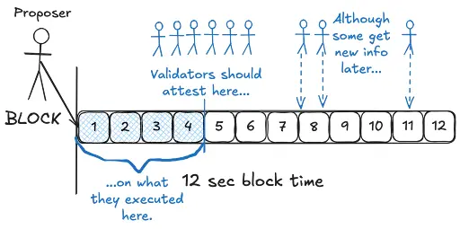

Ethereum limits block execution time by setting a maximum gas usage, currently capped at 30 million with a [target of 15 million](https://eips.ethereum.org/EIPS/eip-1559). Also, each EVM opcode has a predetermined gas cost based on its resource consumption. For instance, the [SSTORE opcode](https://github.com/wolflo/evm-opcodes/blob/main/gas.md) is more costly than simpler operations (e.g., arithmetic addition—ADD) because it involves accessing and modifying the state trie. This differentiated pricing of EVM opcodes, along with total gas limit, aimed to constrain total execution time.

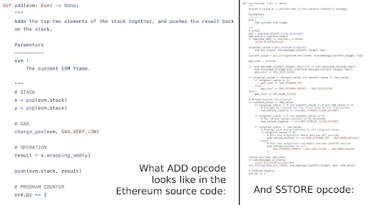

While the gas limit of a block can somewhat constrain block execution time, block propagation time remains unconstrained explicitly.

Block size is a major factor affecting propagation time in public blockchains. Larger block sizes increase network load and bandwidth requirements. If the block size greatly exceeds the bandwidth of most nodes, it takes longer for nodes to fully propagate and receive the block, raising the risk of missed or reorged blocks.

This is why Bitcoin protocol (pre-Segwit) had a cap of 1 MB block size to prevent increased fork rates and ensure the security and low node requirements of the blockchain.

**Presently Ethereum, there is no explicitly set block size limit. However, the theoretical maximum block size can be estimated by considering gas limit, calldata cost, compression rate, etc.**

Currently, the maximum block size of Ethereum is **~2.78 MB**, excluding blobs. This size is significant; if such large blocks were consistently propagated over 10 minutes, it would amount to about 140 MB, which is more than 30 times bigger than Bitcoin in the worst case. This could potentially overload the Ethereum network and cause nodes to have different views for a short period in a DoS attack scenario where 2.78 MB blocks continue for a while.

**In practice, the average block size in Ethereum today is approximately 125 KB**, indicating a significant gap from the maximum block size. This raises another concern regarding inefficiency in resource utilization.

For example, if the network can sufficiently handle 1 MB blocks in a row, a big discrepancy between the average block size and 1 MB suggests that Ethereum has more capacity for Data Availability (DA) functionality but is not utilizing it effectively.

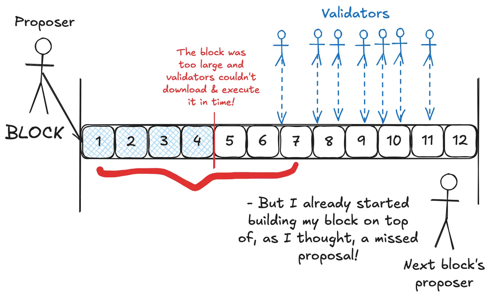

**In practice, the average block size in Ethereum today is approximately 125 KB**, indicating a significant gap from the maximum block size. This raises another concern regarding inefficiency in resource utilization.

For example, if the network can sufficiently handle 1 MB blocks in a row, a big discrepancy between the average block size and 1 MB suggests that Ethereum has more capacity for Data Availability (DA) functionality but is not utilizing it effectively.

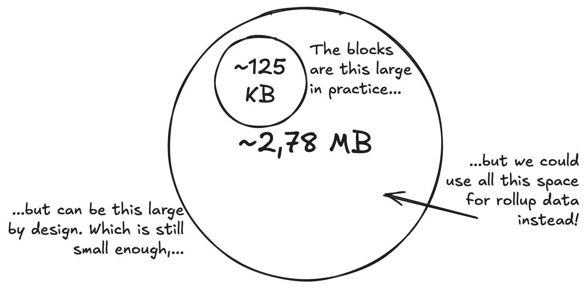

By limiting the maximum block size and aligning the average block size closer to this maximum, Ethereum could reduce consensus risks while achieving more efficient resource utilization. This is why EIP-7623 focuses on the possible maximum block size, which is highly affected by calldata pricing.

## What Is Calldata?

**Calldata impacts the maximum block size.** But what is it, and why does its pricing matter?

**Calldata is a field in a transaction typically used to convey which functions to call and what parameters to pass.**

For example, if you want to mint an NFT, you include the 'mint' method and specific traits of the NFT in the calldata field. The following example shows the first mint transaction of a CryptoPunk in 2017.

The calldata (referred to as ‘input data’ in the figure) contains the ‘getPunk’ function name, represented by 0xc81d1d5b, and the NFT index, represented by 0x00001eb0 (7856 in hexadecimal).

If you only transfer ETH and do not interact with any smart contract, the calldata field is null (0x).

Besides its primary purpose of passing parameters to smart contracts, **calldata is also used for recording simple memos or by rollups storing their transaction data**. In other words, calldata doesn’t always need to interact with smart contracts or follow strict rules; it can contain arbitrary values.

Leveraging this flexibility, optimistic rollups such as Optimism and Arbitrum, and some ZK (validity) rollups, post compressed rollup transaction data and updated states in the calldata field of their sequencing transactions.

Although EIP-4844 has enabled data availability through blobs instead of calldata, calldata is still preferred by small rollups that do not need the full 128 KB of a blob for a single batch.

Calldata is often used for DA functionality because it is the least gas-consuming way to post large data on the EVM. This is why the maximum block size is constrained by the price of calldata. The worst-case scenario occurs when a block is filled with DA purpose transactions that use small amounts of gas but large data sizes.

Currently, the cost of calldata is 4 gas per zero byte and 16 gas per non-zero byte. Calldata can be compressed using snappy compression ([EIP-706](https://github.com/ethereum/EIPs/blob/master/EIPS/eip-706.md)), and the transaction size cannot exceed 125 KB. Accurate calculation of the maximum block size is complex due to the varying nature of compression ratios, but it is known that the block can increase up to ~2.78 MB.

If 2.78 MB blocks continue consecutively due to certain reasons (e.g., spamming attacks), the network could be overloaded, and nodes might have split views due to low propagation speeds. More nodes might attest to different blocks as the canonical chain, increasing the risk of not reaching a consensus. To prevent this, a simple solution could be to increase the cost of calldata.

For example, doubling the cost of calldata to 8 gas per zero byte and 32 gas per non-zero byte could approximately reduce the maximum block size in half.

However, this approach could harm normal user transactions. Increasing calldata costs only to prevent the worst-case scenario might result in a greater loss than gain, given that the average block size is currently only 125 KB and does not pose significant concerns.

## EIP-7623: Motivation

EIP-7623 differs slightly from other proposals that simply increase the calldata cost. Instead, it adjusts the gas cost specifically for transactions that appear to serve data availability (DA) purposes.

In other words, if the gas used in a transaction is insufficient compared to the total data size loaded, it is considered a DA purpose transaction and is charged significantly more for calldata. Conversely, if a transaction consumes enough gas relative to the data size, it is considered a non-DA transaction and is charged the same as it is today.

A useful analogy can be drawn between calldata in Ethereum and plastic bags in the real world. When we buy products or groceries, we often get plastic bags to carry them, usually at a very low cost or even free. However, if individuals can purchase an unlimited number of plastic bags, it would be detrimental to the environment.

A possible solution is to restrict plastic bags to customers who buy enough products or charge a higher price, like $1 per bag. This is analogous to the EIP-7623 approach, which functions as a form of Pigouvian tax. It imposes higher costs on transactions that use a large amount of calldata but insufficient gas, thereby promoting more efficient resource use. By applying more aggressive costs to those who primarily use calldata for data availability rather than a balanced mix of data and execution, the protocol aims to ensure a more efficient and sustainable utilization of network resources.

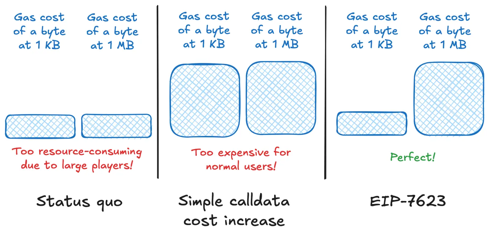

## But why target DA transactions? What is wrong with using Ethereum as a DA platform?

There is nothing inherently wrong with this. EIP-7623 doesn’t discourage Ethereum from functioning as DA; rather, it discourages the use of calldata for DA. It indirectly encourages the use of blobs for DA instead. This proposal aims to separate the execution layer from the data availability layer, allowing each layer to efficiently manage demand and better predict extreme cases.

By doing so, EIP-7623 seeks to enhance the efficiency and predictability of Ethereum’s resource management while limiting DoS surface. This separation ensures that each layer can handle its specific functions more effectively, ultimately contributing to a more robust and scalable Ethereum network.

## EIP-7623: Specifications

The current gas calculation of a transaction is as follows:

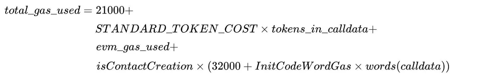

The 21,000 is the minimum gas charged for any transaction. 

Also *STANDARD_TOKEN_COST tokens_in_calldata* represents the gas used for calldata, which EIP-7623 mainly tries to fix. Here, *tokens_in_calldata* is a simple weighted combination of zero and non-zero bytes, which is calculated by *tokens_in_calldata = zero_bytes_in_calldata + 4 \* nonzero_bytes_in_calldata*.

*STANDARD_TOKEN_COST* is currently set to 4, so the gas cost of *zero_bytes_in_calldata* is 4 and *nonzero_bytes_in_calldata* is 16.

*evm_gas_used* is the gas used for execution of a transaction, primarily covering interactions with smart contracts. Non-DA purpose transactions typically have a large *evm_gas_used* component.

When a transaction creates a new contract, the isContractCreation term becomes 1, meaning incurring additional gas for creating and storing the new contract. Since contract creation is not the focus here, we will set this term to zero.

EIP-7623 proposes the following adjustment to the total gas calculation:

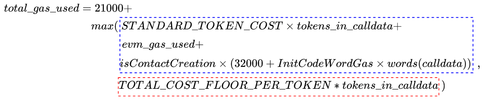

In new calculation, *max(blue box, red box)* compares the gas calculated by current method(blue box), with *TOTAL_COST_FLOOR_PER_TOKEN calldata* (red box). The blue box is exactly the same as the current gas calculation method. The red box, which is new in EIP-7623, represents the value that judges if a transaction is for DA purpose. As of June 30, 2024, *TOTAL_COST_FLOOR_PER_TOKEN* is proposed to be 12, which is much higher than the *STANDARD_TOKEN_COST of 4*.

In other words, if a transaction does not spend enough *evm_gas_used*, the red box will likely be higher value than the blue box value, marking it as a DA purpose transaction. Consequently, the transaction will be charged at the *TOTAL_COST_FLOOR_PER_TOKEN* rate, effectively paying 3 times more for calldata. Conversely, most general purpose transactions spend sufficient *evm_gas_used*, so the *max(blue box,red box)* will default to the blue box value, maintaining the current gas cost method.

## What Kind Of Transactions Are Affected EIP-7623

To determine which transactions are affected by EIP-7623, we need to identify the condition where the red box (new gas calculation) is higher than the blue box (current gas calculation).

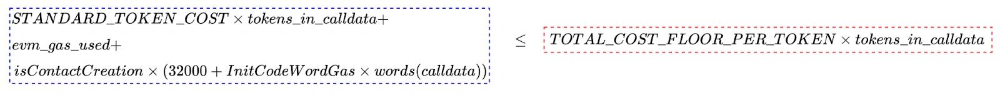

By ignoring the contract creation term and substituting values into the parameters, we derive the following condition: Transactions will incur a higher gas cost if the gas consumed for EVM execution is less than 8 times the tokens in calldata.

To make this more intuitive, let's divide both sides by 4 tokens_in_calldata. Let’s remember that 4 tokens_in_calldata is the gas paid for calldata in a transaction.

This final equation indicates that if the gas used for EVM execution is less than twice the gas used for calldata, the transaction will incur higher fees for calldata.

## How Much Would The Cost Increase?

Let’s assume the minimum gas for a transaction is 21,000, the gas used for EVM execution is k, and the gas used for calldata is kx. The total cost of the transaction can then be expressed as:

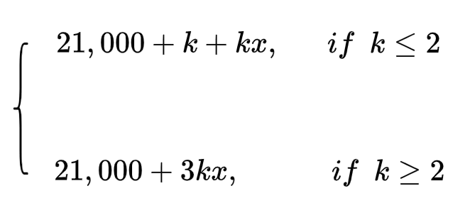

Under the current calculation (without EIP-7623), the cost would be 21,000+k+kx. Therefore, the rate of increase with EIP-7623 would be:

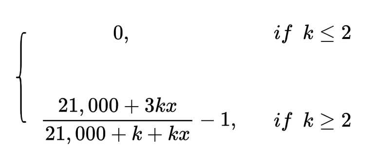

The increase rate as a function of k is plotted below.

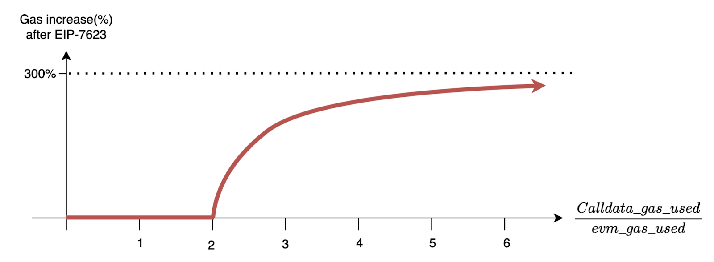

To understand the practical impact, let's examine gas usage statistics for common function methods, focusing on those familiar to most users.

Among the various swap functions in decentralized exchanges, swap(string, address, uint256, bytes) is the most widely used. In median, it uses [5,152 for calldata and 175,742 for EVM](https://nerolation.github.io/eip-7623-impact-analysis/), and this accounts for 34 times bigger value. transfer(address, uint256) function, used for transferring ERC20 tokens, consumes around 24,501 gas for EVM execution, about 40 times more than the 620 gas used for calldata.

Similar to these functions, most daily user transactions have a significant difference between the gas used for calldata and EVM execution, meaning they are unlikely to be affected by EIP-7623.

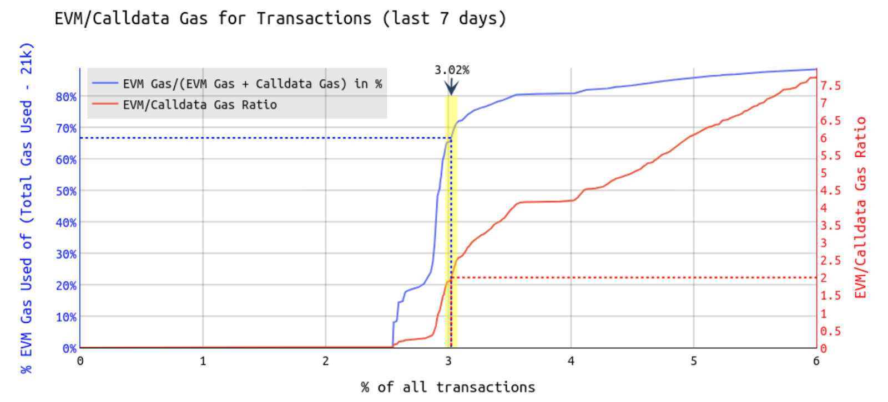
[Source](https://ethresear.ch/t/eip-7623-post-4844-analysis/19199)

Analysis provided by [Toni](https://x.com/nero_eth) shows that if EIP-7623 is applied, 3.02% of recent Ethereum transactions would be affected. His analysis also identifies which function methods will be affected and estimates the cost increase for those methods.

Analysis provided by Toni shows that for recent transactions on Ethereum, 3.02% of transactions get affected if EIP-7623 is applied. His [site](https://nerolation.github.io/eip-7623-impact-analysis/) also shows what function methods will actually be affected, and how much the price would increase for those methods.

Among the functions impacted by EIP-7623, the most frequently used is *addSequencerL2BatchFromOrigin()*, commonly employed for sequencing rollup transactions on Ethereum. Another affected method is [commitBatches()](https://etherscan.io/tx/0x22f50cd691ab950ea171b5941d0de5717d261e69146ba5c93b1e9202f032ec43), frequently used in rollup transactions. These two functions are expected to see the most significant cost increases, with an estimated 150% increase in total gas costs when using these methods.

However, rollups can utilize blobs for data posting, and many rollups, such as Arbitrum One and Base, [are already doing so](https://etherscan.io/tx/0xe66ec2914df43f08a22f73737f6089f71201d3af00e3fb3e91e4958e35c3572c). Consequently, rollups that use blobs for data posting are not likely to be heavily affected by the increased costs imposed by EIP-7623.

## Impact On Block Size

EIP-7623 increases the gas cost for transactions that use high amounts of calldata. This means that spamming attacks, which rely heavily on calldata, would require approximately three times more gas cost, effectively reducing the maximum block size from 2.78 MB to about 1.2 MB.

Consequently, the Ethereum network would be better equipped to handle worst-case scenarios where large blocks are propagated continuously.

The reduction in the maximum possible block size creates an opportunity to increase the number of blobs included per block. Currently, the maximum number of blobs is 6, each 128 KiB in size. If EIP-7623 is adopted and the same maximum block size is maintained, it could be possible to increase the maximum number of blobs to about 18, which means 3x increase in the maximum TPS of rollups.

This calculation involves some oversimplification, as the propagation methods for blobs and blocks differ. However, the primary advantage is the increased separation between the execution and data availability layers. Since blob gas and execution gas have separate fee markets, disturbances in one market will not directly impact the other. This separation simplifies achieving capital efficiency because it becomes easier to control the target and maximum resources that the Ethereum network can handle within a single block.

## Considerations

While EIP-7623 offers significant benefits, it could potentially impact small rollups by necessitating the use of blobs instead of calldata. For low-demand rollups, the large blob size of 128 KiB might require them to wait longer until they can fill the full blob. This situation increases the need for [blob-sharing protocols](https://hackmd.io/@dapplion/blob_sharing), allowing multiple rollups to share the large blob space for better cost efficiency.

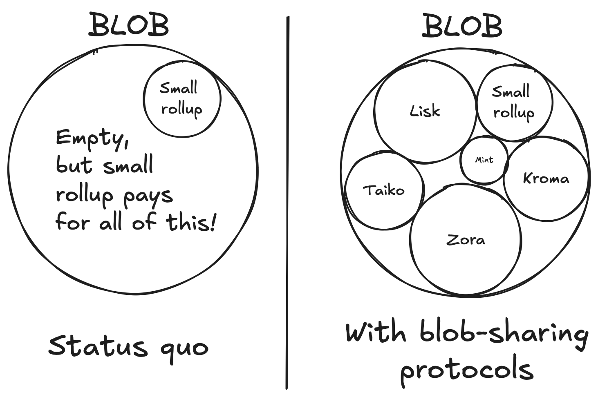

Although the blob base fee is currently very low, making blobs an inexpensive DA space, a [sudden rise](https://blockworks.co/news/ethereum-blob-base-fee-surges) in demand could place a significant burden on these rollups. Without a concurrent increase in the number of blobs per block, EIP-7623 could make rollups submitting DA transactions more competitive, as the total capacity for DA is decreasing overall. It is necessary to assess whether the number of blobs should be increased simultaneously to accommodate this shift.

Another consideration is deciding the criteria for the threshold where transactions should be affected by this update. There are trade-offs between block size and user experience.

For instance, setting the threshold too aggressively might greatly reduce the maximum block size, but many transactions might have to pay more gas for calldata. While the change in maximum block size is explicit and vivid, it is hard to estimate and quantify how much Ethereum would be impacted by requiring higher gas costs for DA purpose transactions. This threshold can only be set socially.

Additionally, the criteria highly depend on other parameters set by EVM operations or the gas limit. For example, if Ethereum were to increase the block gas limit to 300 million in the future, the threshold of EIP-7623 should also be modified to maintain the maximum block size.

## Conclusion

EIP-7623 is an Ethereum improvement proposal that aims to reduce the maximum block size by adjusting the calldata cost, specifically targeting DA purpose transactions. This adjustment could potentially increase the cost for non-blob DA transaction by up to 300%, while most everyday user transactions remain unaffected.

Throughout this post, we have explored the motivation behind the proposal, its implications, the types of transactions affected, and potential concerns that may arise. 

I hope this writing helps you understand more about this recent proposal and provides detailed insights into its contents. If you are interested and want to know more, you can follow up on [Toni Wahrstätter’s](https://ethresear.ch/t/analyzing-eip-7623-increase-calldata-cost/19002) analysis and explanation, and participate in the [open discussion](https://ethereum-magicians.org/t/eip-7623-increase-calldata-cost/18647) on the Ethereum Magicians forum.