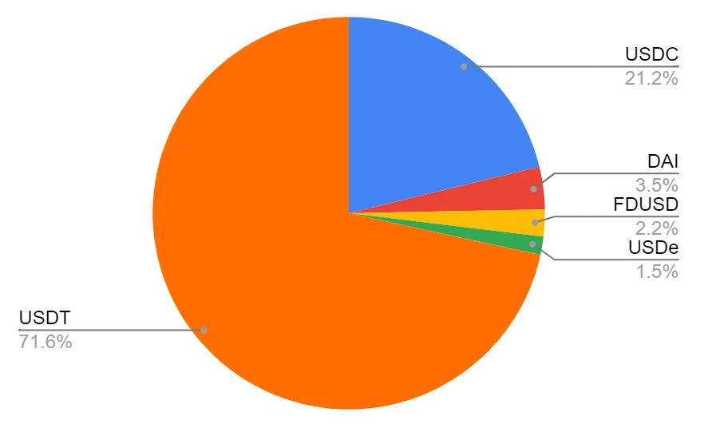
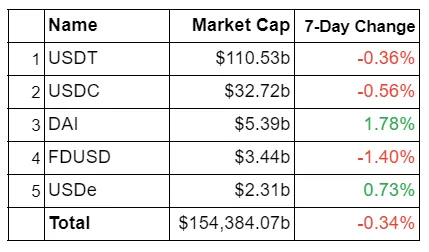
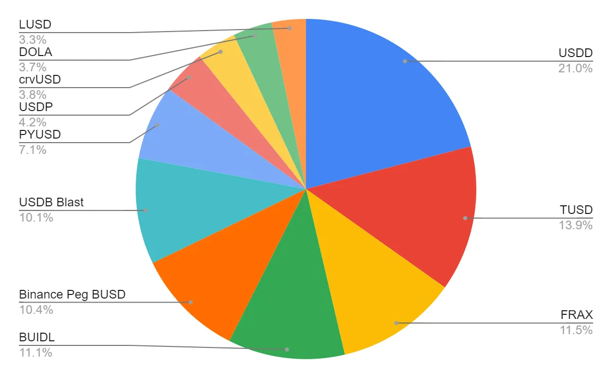
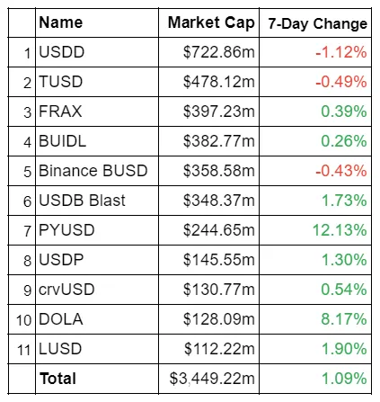
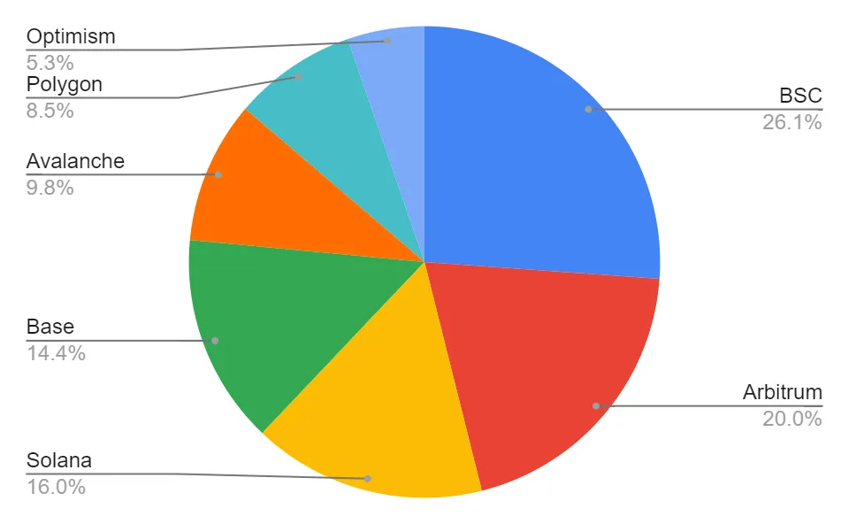
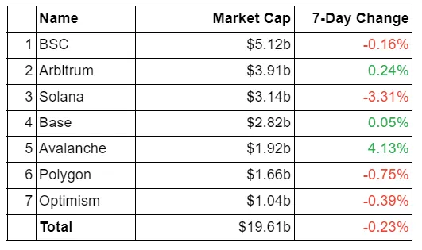
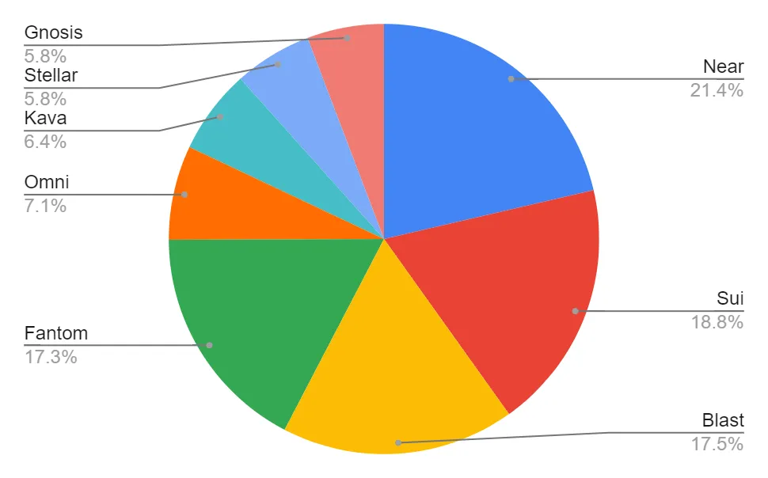
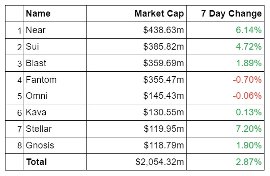
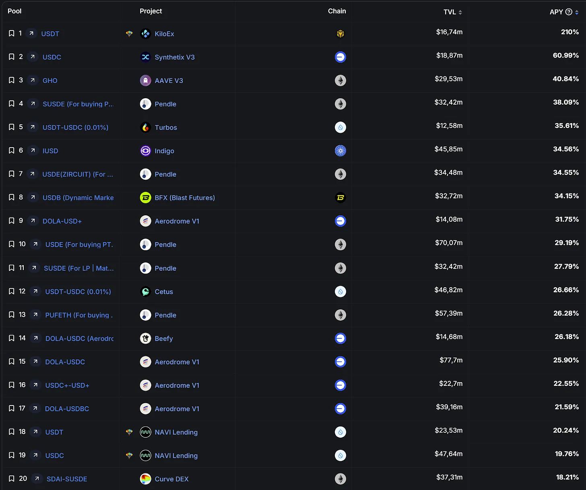

Hey hey stablecoinjoyers! Here is a quick update: from now on I am not using screenshots taken from DefiLlama for graphs. Even though the main source is still DefiLlama, I will create my own graphs with the data retrieved by DefiLlama API. I hope you enjoy this improvement. Let's begin the third post of our weekly stablecoin reports. In this report, you will find:

* Total review of the stablecoin market and a breakdown by projects.

* Total breakdown of the stablecoin market by blockchains.

* The most attractive stablecoin yields.

* Important events and news from the last month.

* Useful resources for more stablecoin information.

## Total Review of Stablecoin Market and Breakdown by Projects

As of May 13th, the total stablecoin market is $160.14 billion, down by 0.30% from last week. USDT dominance of the entire stablecoin market is 69.05%, compared to 69.14% last week. The pie chart below shows the dominance of Tether relative to other stablecoins with a market cap over $1 billion, i.e., the stables of the first league.

Tether is still 3.5 times bigger than its biggest rival Circle, which now has a current circulation amount of USDC around $32.72 billion, a decrease of 0.56% from last week. Like USDC, all fiat-backed stablecoins in this league lost some market cap. FDUSD lost the most with a 1.40% market cap decrease. Whereas Ethena's USDe and Maker's DAI grew slightly . The table below shows the 7-day change in market cap of the stables in the first league.

Now, let's take a look at the second league, i.e., stablecoins between $100m and $1b. We still have 11 stablecoins in this segment . Their total circulation amount is currently $3.45 billion, an increase of 1.09% from last week. The pie chart below illustrates the market cap distribution between the coins.

We didn't see any flippening last week, meaning every stablecoin in this league is protecting their position from previous week. However, we still saw a few major changes. PayPal's PYUSD grew 12.13%, followed by DOLA's 8.17% growth. On the flip side, we see USDD with a 1.12% decrease, making it the biggest loser of the week. Besides USDD, TUSD and BUSD also closed in the red last week. The table below shows the 7-day change in market cap of the stablecoins in the second league.

## Total Breakdown of Stablecoin Market by Blockchains

Now let's examine the competition among chains to attract more stablecoins. Similar to last week, Ethereum and Tron hold more than 85% of the total stablecoin market.

To analyze the competition, we need to exclude Ethereum and Tron, just like the previous reports. However, I slightly modified our approach.

If you read the second or first report, you would notice we classified chains with more than $100m market cap of stablecoins as B-tier (Ethereum and Tron excluded). From now on, we will investigate them in two pieces:

* **B-tier**will refer to chains having more than $1b market cap of stablecoins.

* **C-tier**will refer to chains having more than $100m market cap of stablecoins.

This modification will help us analyze the chains having around $100m market cap of stablecoins. Now let's start with the B-tier chains. Here is the pie chart:

Here we don't have any flips as well. The most gainer of the week is Avalanche with a 4.13% increase in stablecoin market cap, and the most loser is Solana with a 3.31% decrease in stablecoin market cap. The remaining ones faced relatively small changes such that all of them are less than 0.75%.

The C-tier comes with two flippenings! Firstly, last week Fantom was holding the third position where Blast was the fifth, but this changed due to a 1.89% increase in the stablecoin market on Blast and a 0.70% decrease on Fantom. And the second flip was by Stellar which experienced a 7.2% growth. Though the total stablecoin market cap on Gnosis increased by 1.90%, it wasn't enough to protect its position from Stellar.

Near also experienced notable growth of 6.14%, leading to a $438.8m market cap of stablecoins. Near's growth is particulaty noteworthy because, last week, it also saw a 10.81% increase in stablecoins on itself. Sui reached 4.72% growth in terms of stablecoins which makes it the third most gainer of the week in this tier. More details are in the table below.

## The Most Attractive Stablecoin Yields

Let's take a look at the stablecoins offering the highest APYs. These yields are sourced from DeFiLlama and include all types of yields with over $10 million in TVL. Remember that interactions with contracts carry various risks, including hacks, exploits, impermanent loss, depegging scenarios, etc. Please be aware of these risks before engaging and always DYOR!

## Important Events and News of Last Week

* Seraphim Czecker, Head of Growth at Ethena, recently [hinted](https://twitter.com/MacroMate8/status/1788862484952084674) that Ethena is developing its own blockchain. With USDe's market cap exceeding $2.3 billion, Ethena is poised to hold a significant competitive edge in the blockchain arena.

* [MarginFi is gearing up to launch XBY](https://thedefiant.io/news/defi/marginfi-to-launch-solana-lst-backed-decentralized-stablecoin-this-month), its yield-accruing decentralized stablecoin, this month on Solana. Their goal isto lessen the network's dependence on USDC. MarginFi co-founder MacBrennan Peet, announced at the Solana Crossroads 2024 conference that XBY will be fully backed by SOL-based liquid staking protocols. Despite recent turbulence following the resignation of co-founder Edgar Pavlovsky, Peet reassured that the project has secured about $12 million in initial liquidity and plans for a future governance token.

* Ethena Labs has [introduced](https://thedefiant.io/news/defi/ethena-integrates-with-bybit-to-add-usde-as-collateral-asset) a partnership with Bybit, incorporating its USDe stablecoin as a new collateral asset on the exchange. This integration allows users to engage in zero-fee trading with major cryptocurrency pairs while capitalizing on potential yields from Ethena. The move is seen as a strategic step to enhance USDe's presence in competitive trading environments, paralleling major stablecoins like USDT and USDC.

* The UK government is on a fast track to implement new regulations for stablecoins and crypto staking,[according to Economic Secretary Bim Afolami](https://www.coindesk.com/policy/2024/05/08/uk-minister-says-government-only-has-time-to-implement-stablecoin-staking-legislation/). Speaking at the Financial Times Crypto and Digital Asset Summit, Afolami highlighted that these regulations are a top priority, with legislation expected to pass in the coming weeks. This rapid advancement underscores the UK's ambition to establish itself as a global crypto hub amidst political pressures and upcoming elections.

* [Research from Sacra suggests](https://cointelegraph.com/news/could-stablecoin-volumes-overtake-visa-this-quarter)stablecoin transaction volumes could surpass those of Visa this quarter due to their increasing use in cross-border payments. Despite skepticism from Visa's head of crypto, who pointed out the high volume of inauthentic transactions, stablecoins are praised for their convenience and low cost, potentially positioning them as a dominant force in global payments.

* Kelp,[in a recent AMA hosted by Cointelegraph](https://cointelegraph.com/news/is-kelp-the-key-to-a-more-stable-future-for-crypto-ama-recap), outlined its innovative approach to stabilizing cryptocurrency prices through a unique monetary policy. Edward Bishop, CEO of Kelp, explained that their protocol adjusts its supply based on economic indicators to maintain stability and purchasing power, setting it apart from traditional and algorithmic stablecoins.

* The European Union's MiCA regulation is set to [standardize](https://cointelegraph.com/news/eu-crypto-regulations-enforcement)crypto assets market-wide, yet enforcement inconsistencies have been noted, with some industry players expressing concerns over the fairness and effectiveness of regulatory practices. These issues highlight the challenges in harmonizing crypto regulations across member states, according to Jon Helgi Egilsson of Monerium.

* [Tether is expanding its influence in Eastern Europe](https://cointelegraph.com/news/tether-crypto-pay-eastern-europe-citypay)by increasing its investment in CityPay.io, a Georgian-based crypto payment provider. This expansion aims to enhance cryptocurrency payment infrastructure across several countries, with plans to establish extensive crypto payment points and introduce new e-wallet and card solutions.

* [At the FT Live Crypto and Digital Assets Summit](https://cointelegraph.com/news/ctfc-cbdc-stablecoins-libertarian-values), former CFTC Chair J. Christian Giancarlo emphasized the importance of designing CBDCs and stablecoins that uphold liberty, privacy, and economic freedom. Highlighting the need for these values in the evolving digital currency landscape, Giancarlo advocated for standards that reflect human dignity and financial autonomy.

* [Tether's co-founder, William Quigley, has highlighted](https://cointelegraph.com/news/money-tokenization-greatest-invention-fiat-tether)the potential of tokenizing fiat currencies as a significant innovation since the invention of fiat itself, suggesting that such advancements could eventually offer interest yields. During a recent summit, he emphasized the benefits of enhanced global financial mechanisms through tokenized fiat, particularly noting how stablecoins like USDT could evolve.

* [Tether has robustly defended its stablecoin](https://cointelegraph.com/news/tether-slams-deutsche-bank-over-suggestion-stablecoin-could-fail)against claims by Deutsche Bank suggesting potential instability similar to TerraUSD. The bank's report doubted Tether's transparency and solvency, prompting Tether to criticize the irony given Deutsche Bank's own history of financial issues.

* [Last month marked a record for Ethereum's stablecoin volumes](https://www.theblock.co/post/292574/ethereum-stablecoin-volume-shattered-its-monthly-record-in-april-thanks-to-dai), largely driven by DAI's involvement in complex flash loan transactions. This surge highlights DAI's crucial role in Ethereum's on-chain dynamics and its significant impact on the stablecoin market.

* JPMorgan and Visa are [making](https://www.dlnews.com/articles/markets/jpmorgan-and-visa-jump-into-ambitious-tokenisation-project-in-bullish-sign-for-digital-ledgers/)strides in the financial sector by intensifying their efforts in asset tokenization, aiming to enhance the efficiency of global financial transactions. Their collaborative projects are exploring the transformative potential of tokenizing cash and other assets to improve the speed and reduce the costs of payment systems and securities transactions.

* Major financial players like JPMorgan and BlackRock are tapping into the [tokenization](https://www.dlnews.com/articles/markets/jpmorgan-and-goldman-seize-on-huge-tokenisation-opportunity/)market, potentially influencing a market worth up to $14 trillion. These firms are exploring the application of blockchain technology across various assets, including bonds and commodities, aiming to revolutionize the ways in which investments and trading are conducted.

## Amazing Resources for More Stablecoin Insights

* [visaonchainanalytics.com](https://visaonchainanalytics.com/)
  
* [defillama.com](https://defillama.com/)

* [stable.fish](https://stable.fish/)
  
* [bluechip.org](https://bluechip.org/)
  
* [serenityresearch.substack.com](https://serenityresearch.substack.com/)
  
* [cryptorisks.substack.com](https://cryptorisks.substack.com/)
  
* [thedefiant.io](https://thedefiant.io/)

* [coindesk.com](https://www.coindesk.com/)
  
* [cointelegraph.com](https://cointelegraph.com/)

* [theblock.co](https://www.theblock.co/)

## Last Words

I hope you've found this report informative. I'm sure you realized that the quality of reports directly increased after the Ethereum 2077 collaboration. I promise it will increase more during this journey.

In the meantime, you can read other posts on Ethereum2077. And if you've missed last week's report, you can read it [here](https://research.2077.xyz/research/weekly-stable-report-2/). Finally, keep enjoying stability!
